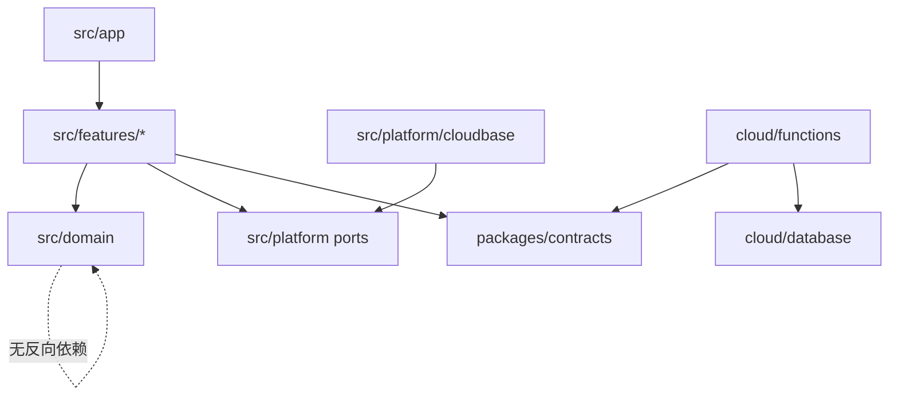
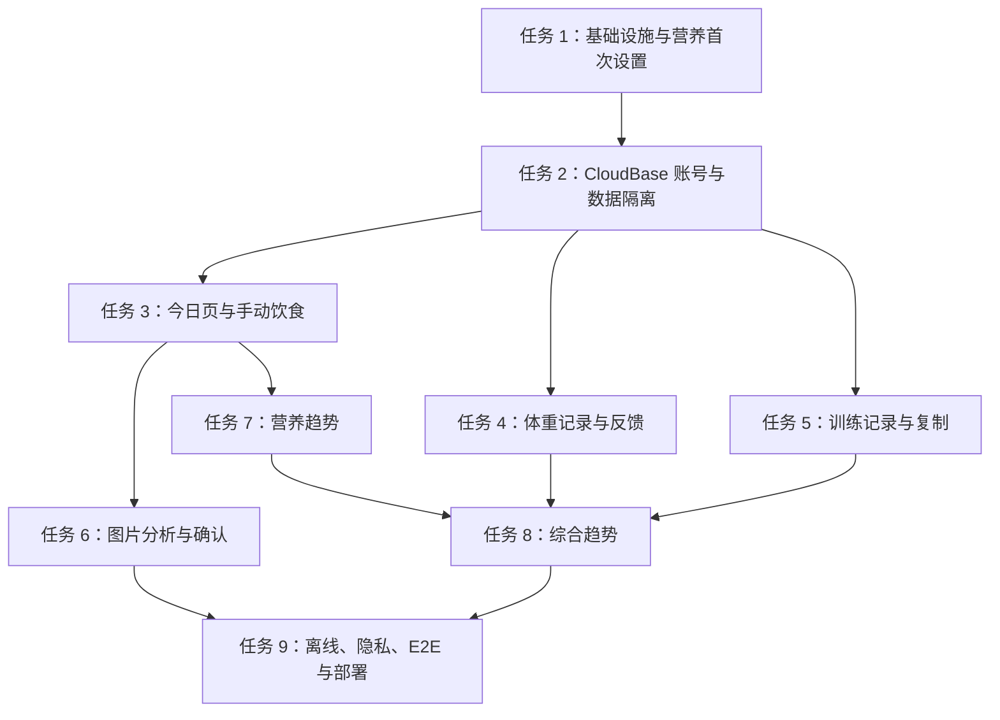

# 架构方案：个人饮食与训练记录 PWA

## 执行元数据

- **Status**：active
- **Workflow Stage**：plan
- **Created**：2026-07-13
- **Updated**：2026-07-16
- **Source Of Truth Until**：本计划被执行完毕、被新版计划取代或被明确放弃
- **Requirements Source**：`docs/anvil/brainstorms/2026-07-13-personal-fitness-nutrition-pwa.md`（用户已于 2026-07-13 确认）
- **Compounded Knowledge**：not yet compounded
- **Readiness Path**：`pnpm lint && pnpm typecheck && pnpm test:cloud-functions && pnpm typecheck:cloud-functions && pnpm test && pnpm build && pnpm build:cloud-functions && pnpm smoke:cloud-functions && pnpm preflight:cloudbase-manual && pnpm validate:manual-smoke-result docs/operations/manual-smoke-result-template.md && pnpm validate:cloudbase-rpc-docs && pnpm vitest run tests/security/buildArtifactSafety.test.ts && pnpm test:e2e`
- **Resume Point**：任务 4「体重记录与热量反馈」、任务 5「训练记录、复制与容量」、任务 6「图片分析、人工确认与失败恢复」、任务 7「营养趋势」、任务 8「综合趋势」和任务 9「离线草稿、隐私删除、系统 E2E 与部署」均已完成本地自动化、移动端 E2E、Anvil 审阅、状态回写、保护性提交和 GitHub 推送；README 交付入口也已在 `78c79981 docs: update project handoff readme` 更新并推送。2026-07-16 续作补齐了任务 6 的真实云函数本地缺口：`mealPhotoAnalysis` 云函数部署入口、服务端 `http-json`/OpenAI-compatible 视觉模型 provider、私有对象存储适配、auth-bound RPC 数据库网关、按用户/日期计数 RPC 和部署文档中的服务端 `PHOTO_MEAL_*` 变量。随后补全 `docs/operations/cloudbase-test-environment.md`，将真实环境验收范围从早期 profile/goal 扩展到全业务表、全部 auth-bound RPC、`mealPhotoAnalysis` 云函数、模型 secret、账号数据删除和中国大陆网络 smoke，并用 `tests/security/buildArtifactSafety.test.ts` 防退化。最新续作补齐了云函数可部署包和 Node SDK 适配边界：`cloud/functions/*` 纳入 pnpm workspace，`meal-photo-analysis` 提供 `test`/`typecheck`/`build`/`smoke` 脚本、`tsconfig.json`、Vite library build、`dist/index.js`、`dist/package.json` ESM 元数据和 `@cloudbase/node-sdk` 服务端依赖、可部署 `main` 入口、Node SDK 懒加载兼容、显式对象存储 adapter（只向 Node SDK `uploadFile` 传 `cloudPath` 和 `fileContent`）和 `CLOUDBASE_*` 初始化变量说明，根目录新增 `pnpm test:cloud-functions` / `pnpm typecheck:cloud-functions` / `pnpm build:cloud-functions` / `pnpm smoke:cloud-functions` / `pnpm preflight:cloudbase-manual` 门禁；smoke 已独立成 `scripts/smoke-dist.mjs`，会实际导入 dist、验证 `dist/package.json`、验证对象存储 adapter 不透传 `contentType`、扫描云函数部署包不含 source map、浏览器 SDK、`window`/`document`、测试平台标记或 secret-like 字符串、调用 dist `main` 并确认未认证请求稳定停在 `unauthenticated`；manual preflight 会检查真实 CloudBase/模型环境变量齐全、地域和模型参数合法且不输出实际 key/endpoint/secret；真实 smoke 脱敏结果模板已补到 `docs/operations/manual-smoke-result-template.md` 并从 README、部署文档和 CloudBase 隔离环境文档链接，防止验收记录泄露真实邮箱、验证码、session、token、照片对象 key、签名 URL、模型响应原文或 secret；`.github/workflows/ci.yml` 已补齐 push / pull request 自动门禁，覆盖 lint、typecheck、云函数 test/typecheck/build/smoke、单元与安全测试、production build、产物扫描和 test-platform 移动端 E2E，且不注入真实 CloudBase/model secret；Node 运行边界已按真实 CI 结果统一为 `^20.19.0 || >=22.13.0`，README、本地开发文档、`package.json` 和 CI 防退化测试保持一致；Draft PR 已创建为 https://github.com/IP-DZ/daily-record/pull/2，作为 review/merge 入口。最新证据：ESLint passed；root typecheck passed；cloud function package test/typecheck/build/smoke passed；manual preflight tests passed；production build passed；50 files / 448 Vitest tests passed；build artifact safety 8/8；`mobile-chromium` E2E 8 passed / 1 real CloudBase manual skipped；GitHub Actions CI passed；`git diff --check` passed。任务 9 的细化执行来源为 `docs/anvil/plans/2026-07-15-system-hardening-deployment-plan.md`，已交付离线草稿恢复、隐私设置/清空应用数据、PWA/部署运维加固、生产构建产物安全扫描和完整移动端系统 E2E。真实 CloudBase、真实视觉模型和中国大陆网络 smoke 仍保持环境 blocker，owner=仓库所有者，next=按 `docs/operations/cloudbase-test-environment.md`、`docs/operations/deployment.md` 和 `docs/operations/manual-smoke-result-template.md` 配置隔离环境、云函数服务端 `PHOTO_MEAL_*` secret、测试图片策略、测试邮箱和大陆网络设备后运行 preflight、manual/smoke 并记录脱敏摘要。
- **2026-07-16 续作证据**：manual preflight 继续加固，新增 RED/GREEN 回归覆盖公开 `VITE_CLOUDBASE_*` 与云函数 `CLOUDBASE_*` 环境 ID/地域不一致时必须失败，防止前端静态托管和 `mealPhotoAnalysis` 云函数误指向不同隔离环境；同时保留服务端 secret 被误放进 `VITE_*` 时失败且不输出真实 secret 的检查。验证：`pnpm_config_verify_deps_before_run=warn pnpm vitest run tests/security/cloudbaseManualPreflight.test.ts`，5 tests passed。
- **2026-07-16 续作证据**：新增 `pnpm validate:manual-smoke-result path/to/manual-smoke-result.md` 脱敏校验，提交或分享真实 CloudBase smoke 结果前自动拦截真实邮箱、验证码、session/JWT、CloudBase 对象路径、签名 URL 和 secret-like 值；输出只包含问题类型和行号，不回显敏感原文。验证：`pnpm_config_verify_deps_before_run=warn pnpm vitest run tests/security/manualSmokeResultValidator.test.ts`，3 tests passed。
- **2026-07-16 续作证据**：`validate:manual-smoke-result` 继续加固，新增 RED/GREEN 回归覆盖公网 IP 与 CloudBase 环境 ID 泄露，防止大陆网络 smoke 记录把网络地址或隔离环境标识写入仓库/PR/截图说明。验证：`pnpm_config_verify_deps_before_run=warn pnpm vitest run tests/security/manualSmokeResultValidator.test.ts`，3 tests passed。
- **2026-07-16 续作证据**：`.github/workflows/ci.yml` 将 `pnpm validate:manual-smoke-result docs/operations/manual-smoke-result-template.md` 纳入不需要真实 CloudBase secret 的自动 release gate；Readiness Path、README 和部署文档同步该门禁，`tests/security/buildArtifactSafety.test.ts` 防退化覆盖 CI 命令。验证：`pnpm_config_verify_deps_before_run=warn pnpm vitest run tests/security/buildArtifactSafety.test.ts`。
- **2026-07-16 续作证据**：新增 `pnpm validate:cloudbase-rpc-docs`，从 `cloud/database/migrations/*.sql` 提取 `CREATE FUNCTION public.*` 并确认全部 RPC 名称已列入 `docs/operations/cloudbase-test-environment.md` 的真实 CloudBase 隔离环境 smoke 检查；该门禁已加入 CI、Readiness Path、README 和部署文档，避免新增/调整 RPC 后环境验收清单漂移。验证：`pnpm_config_verify_deps_before_run=warn pnpm vitest run tests/security/cloudbaseRpcDocs.test.ts`，1 test passed。

## 交付拆分

完整规格跨越账号、营养、饮食、AI、训练、趋势、隐私与部署。为避免一次实施同时修改所有共享契约，按以下可独立验收的纵向切片推进：

1. 基础设施、营养计算与首次设置。
2. CloudBase 登录、数据隔离与目标同步。
3. 今日页与手动饮食闭环。
4. 图片分析、确认与失败恢复。
5. 体重、训练和趋势。
6. 离线草稿、隐私删除、端到端验收与部署。

首个详细执行计划位于 `docs/superpowers/plans/2026-07-13-foundation-nutrition-onboarding.md`。后续切片在开始前生成各自的细化执行计划，但本文始终是 DAG 与状态的唯一来源。

## 文件与模块边界

### 模块：应用外壳 `src/app`
- **职责**：路由、全局 Provider、错误边界、移动端布局与底部导航。
- **输入**：认证状态、路由位置、查询缓存。
- **输出**：页面组合与导航行为。
- **依赖**：功能模块公开页面入口，不读取功能模块内部文件。
- **不变量**：不包含营养公式、数据库查询或云密钥。

### 模块：领域核心 `src/domain`
- **职责**：营养目标、日汇总、体重反馈、训练容量等纯计算及共享领域类型。
- **输入**：显式、已校验的值对象。
- **输出**：不可变计算结果或带类型错误。
- **依赖**：无浏览器、React、CloudBase 或网络依赖。
- **不变量**：相同输入得到相同输出；内部保留小数，展示层负责格式化。

### 模块：平台端口 `src/platform`
- **职责**：定义认证、数据库、存储、AI、时钟、请求 ID 与日志端口，并提供 CloudBase/测试实现。
- **输入**：领域命令和当前会话。
- **输出**：领域 DTO 或标准化错误。
- **依赖**：浏览器 `@cloudbase/js-sdk` 只允许出现在 `src/platform/cloudbase`；服务端 `@cloudbase/node-sdk` 只允许出现在 `cloud/functions/*`。
- **不变量**：浏览器包不包含管理密钥；所有用户数据操作由会话用户约束。

### 模块：功能切片 `src/features/*`
- **职责**：按用户任务组织页面、组件、查询、命令和表单 schema。
- **输入**：平台端口、领域函数和用户交互。
- **输出**：可测试的页面行为。
- **依赖**：只能依赖 `domain`、`platform` 公共接口和共享 UI；功能之间通过公开 DTO 协作。
- **不变量**：AI 临时结果在确认前不得调用正式餐次写入命令。

### 模块：云端函数 `cloud/functions/*`
- **职责**：受信任的目标计算复核、图片分析代理、事务写入、级联删除、孤立对象清理。
- **输入**：已认证请求和 Zod 合约。
- **输出**：版本化 JSON 合约与稳定错误码。
- **依赖**：数据库、私有存储和模型适配器。
- **不变量**：鉴权先于资源读取；正式餐次写入为单事务；日志不含照片、验证码或密钥。

### 模块：数据库与权限 `cloud/database`
- **职责**：迁移、约束、索引、RLS/等价策略与权限验证。
- **输入**：受控迁移。
- **输出**：可重复创建的 schema 与策略。
- **依赖**：CloudBase PostgreSQL。
- **不变量**：所有用户拥有表含 `user_id`；默认拒绝跨用户访问；AI 请求 ID 在用户范围内唯一。

### 模块：测试 `tests` 与同目录 `*.test.ts`
- **职责**：单元、合约、权限、组件与端到端证据。
- **输入**：公共接口与隔离测试环境。
- **输出**：确定性通过/失败结果及必要截图。
- **依赖**：Vitest、Testing Library、Playwright。
- **不变量**：测试不得依赖真实照片、真实邮箱或生产密钥。

## 依赖方向



## 接口定义

```ts
export type UserId = string & { readonly __brand: 'UserId' };
export type IsoDate = string & { readonly __brand: 'IsoDate' };

export interface NutritionInputs {
  age: number;
  sex: 'male' | 'female';
  heightCm: number;
  weightKg: number;
  activityLevel: 'sedentary' | 'light' | 'moderate' | 'high' | 'veryHigh';
  proteinGramsPerKg: number;
  fatCalorieRatio: number;
  surplusRatio: number;
}

export interface NutritionTargets {
  restingKcal: number;
  maintenanceKcal: number;
  caloriesKcal: number;
  proteinGrams: number;
  fatGrams: number;
  carbsGrams: number;
}

export interface AuthPort {
  requestEmailCode(email: string): Promise<void>;
  verifyEmailCode(email: string, code: string): Promise<{ userId: UserId }>;
  signOut(): Promise<void>;
  currentUser(): Promise<{ userId: UserId } | null>;
}

export interface MealRepository {
  listByDate(date: IsoDate): Promise<Meal[]>;
  saveManual(command: SaveMealCommand): Promise<Meal>;
  confirmAnalysis(command: ConfirmAnalysisCommand): Promise<Meal>;
  deleteMeal(mealId: string): Promise<void>;
}

export interface AiAnalysisPort {
  create(command: CreateAnalysisCommand): Promise<AiAnalysis>;
  get(analysisId: string): Promise<AiAnalysis>;
}
```

共享请求/响应 schema 位于 `packages/contracts`，浏览器与云函数共同引用。接口用 `schemaVersion: 1` 版本化；错误统一为 `{ code, message, requestId, retryable }`。

## 数据与安全设计

- PostgreSQL 迁移按 `cloud/database/migrations/NNNN_name.sql` 顺序执行；迁移必须可在空库重复验证。
- `profiles` 以 `user_id` 为主键；其他用户表含 `user_id` 外键和常用日期索引。
- `food_items`、`workout_exercises`、`workout_sets` 使用级联外键；删除餐次/账号时云函数同时清理私有对象并返回核对计数。
- 每个写命令带 `requestId`；`ai_analyses(user_id, request_id)` 建唯一索引。
- 图片对象键为 `users/{userId}/meals/{analysisId}/{uuid}.webp`，读取仅签发短时 URL。
- 每账号每天图片分析上限默认 20 次；服务端配置可覆盖，客户端只展示剩余次数。
- CloudBase 环境 ID、模型名和公开端点通过环境变量注入；AI/数据库管理密钥只存在云函数环境。

## 性能与可用性预算

- 手机 4G、冷缓存、生产构建下：LCP 目标 ≤ 2.5 秒，初始压缩 JavaScript 目标 ≤ 250 KB。
- 今日页个人数据查询 p95 ≤ 800 ms；手动餐次保存 p95 ≤ 1.5 秒（不含用户网络异常）。
- 图片在浏览器压缩为 WebP/JPEG，最长边 ≤ 1600 px、单张目标 ≤ 1.5 MB。
- AI 分析 30 秒超时；schema 无效只重试 1 次；失败不写正式餐次。
- 断网草稿保存在 IndexedDB；恢复网络后必须由用户点击继续，禁止后台自动提交。

## 日志规范

所有结构化日志字段固定为：

```ts
interface AppLog {
  timestamp: string;
  level: 'info' | 'warn' | 'error';
  event: string;
  requestId?: string;
  userIdHash?: string;
  entityType?: string;
  entityId?: string;
  durationMs?: number;
  outcome: 'success' | 'rejected' | 'failure';
  errorCode?: string;
}
```

发出点：认证请求/验证、目标保存、餐次事务、AI 请求/重试/确认、删除任务、限流、定时清理。禁止记录邮箱全文、验证码、图片内容、签名 URL、模型密钥及自由文本备注。

## RTK 过滤预设

- 单元测试：`pnpm test -- --run src/domain/nutrition/nutrition.test.ts`
- 组件测试：`pnpm test -- --run src/features/<feature>`
- 类型检查：`pnpm typecheck 2>&1 | tail -80`
- 端到端：`pnpm test:e2e -- --project=mobile-chromium --reporter=line`
- 迁移验证：`pnpm db:test 2>&1 | rg 'PASS|FAIL|ERROR|policy|migration'`
- 体积检查：`pnpm build && du -sh dist && find dist/assets -type f -maxdepth 1 -print`
- 实施期间运行 `rtk gain` 观察过滤收益，但不把 RTK 作为构建依赖。

## 历史经验约束

当前项目没有 `docs/solutions` 历史知识库，因此没有可复用的既有项目经验约束。

## 关键模式检查

- ❌ React 页面直接调用 CloudBase SDK；✅ 页面依赖 `platform` 端口。
- ❌ AI 返回直接写入 `meals`；✅ 先落 `ai_analyses`，用户确认后事务转正。
- ❌ 用前端过滤实现隔离；✅ 数据库/存储默认拒绝并按会话用户授权。
- ❌ 缓存营养汇总但不维护一致性；✅ 首版查询时从正式条目聚合，必要时再通过同事务物化。
- ❌ 自动接受体重调节建议；✅ 只展示 ±100 kcal 建议，用户明确确认后新建目标版本。
- ❌ 离线恢复后自动重放；✅ 草稿恢复后等待用户主动提交。

## 简化审计

- 首版不引入微服务、GraphQL、状态机框架、事件总线或自建认证服务。
- 不提前物化所有趋势；个人规模由索引查询和客户端纯函数聚合满足。
- 不建设通用插件系统；仅为视觉模型保留一个服务端适配器接口。
- 不做后台自动同步队列；只实现本地草稿和用户确认恢复。
- 删除上述之外的抽象后仍满足规格，已通过“删除 50%”审计。

## 任务 DAG



## 并行执行计划

| Layer | Parallel Group | Tasks | Execution | Reason |
|---|---|---|---|---|
| 1 | G1 | 任务 1 | serial | 创建共享配置、领域接口和测试设施 |
| 2 | G2 | 任务 2 | serial | 修改共享认证、schema、迁移和权限契约 |
| 3 | G3A | 任务 3 | serial | 建立餐次共享接口，供 AI 与营养趋势依赖 |
| 3 | G3B | 任务 4、任务 5 | parallel | 各自拥有独立 feature、表和测试目录 |
| 4 | G4A | 任务 6 | serial | 修改餐次确认接口、云函数和存储策略 |
| 4 | G4B | 任务 7 | parallel | 只读取已稳定餐次接口，写集独立 |
| 5 | G5 | 任务 8 | serial | 组合体重、营养和训练公开读模型 |
| 6 | G6 | 任务 9 | serial | 修改全局 PWA、删除流程、E2E 和部署配置 |

## 任务列表

### 任务 1：基础设施、营养计算与首次设置
- **Code Status**：done（详细执行计划 Task 1–5、整分支终审修复与复核均完成，并纳入首个保护性提交）
- **Actual Write Set**：`package.json`、`pnpm-lock.yaml`、`tsconfig*.json`、`vite.config.ts`、`eslint.config.js`、`index.html`、`src/main.tsx`、`src/app/**`、`src/test/setup.ts`、`src/domain/nutrition/**`、`src/features/onboarding/**`、`src/platform/settings/**`、`src/platform/storage/**`、`public/**`、`playwright.config.ts`、`tests/e2e/**`、`docs/operations/**`、需求/计划状态文档
- **Verification**：`pnpm lint && pnpm typecheck && pnpm test && pnpm build && pnpm test:e2e -- --project=mobile-chromium`
- **Evidence**：终审修复后 lint、typecheck、74 个 Vitest 测试、PWA build、`git diff --check` 与 1 个 `mobile-chromium` E2E 全部通过；批准结论见 `.ai/anvil/reviews/2026-07-13-onboarding-foundation-review.md`
- **PWA 验收状态**：partial；已有 artifact、unit 与移动流程证据，真实 Service Worker、离线、安装和更新生命周期验收仍归任务 9
- **Layer**：1
- **Parallel Group**：G1
- **Execution**：serial
- **Parallel Blocker**：共享配置、路由、领域类型和全局测试设施
- **Ownership**：`package.json`、构建配置、`src/app/**`、`src/domain/nutrition/**`、`src/features/onboarding/**`、`src/platform/settings/**`、`tests/e2e/onboarding.spec.ts`
- **Read Set**：需求规格、设计快照、`AGENTS.md`
- **Write Set**：同 Ownership
- **描述**：建立 React/TypeScript/Vite PWA 基座，以 TDD 完成公式、校验、首次设置与可编辑目标预览。
- **成功标准**：单元测试覆盖全部公式和边界；移动视口 E2E 完成设置并看到四项目标；`pnpm lint && pnpm typecheck && pnpm test && pnpm build` 全通过。
- **预估 Token**：180k
- **依赖**：无
- **涉及文件**：详见首个 Superpowers 执行计划。
- **执行指令**：执行 `docs/superpowers/plans/2026-07-13-foundation-nutrition-onboarding.md`，完成后更新本文任务状态。

### 任务 2：CloudBase 账号、数据 schema 与隔离
- **Code Status**：partial（本地合约、认证、RLS、按用户本地草稿、资料同步与移动 E2E 已实现；真实 CloudBase OTP/双会话/跨设备 smoke 因隔离环境缺失而 blocked）
- **Actual Write Set**：`packages/contracts/**`、`src/platform/auth/**`、`src/platform/cloudbase/**`、`src/platform/settings/**`、`src/platform/testing/**`、`src/features/auth/**`、`src/features/onboarding/**`、`src/app/**`、`cloud/database/**`、`tests/security/**`、`tests/e2e/auth*.spec.ts`、`tests/e2e/cloudbase-auth.manual.spec.ts`、`playwright.config.ts`、`.env.example`、workspace/依赖配置、`docs/operations/cloudbase-test-environment.md`与本状态段
- **Verification**：`CI=true pnpm lint && CI=true pnpm typecheck && CI=true pnpm test && CI=true pnpm build && CI=true pnpm test:e2e -- --project=mobile-chromium`；生产产物扫描服务端密钥标识、固定测试 OTP、测试邮箱与 token；初始 JS gzip 预算 ≤ 250 KB
- **Evidence**：终审安全修复后 ESLint、`tsc -b`、17 files / 237 Vitest tests、production PWA build 与 `git diff --check` 通过；focused PGlite 权限套件 44/44 通过；初始 JS gzip 100.87 KB。2026-07-14 最新 `mobile-chromium` 证据为 2 passed / 1 manual skipped，自动覆盖原 onboarding 回归以及内存平台的 OTP、会话恢复、A/B 切换、跨 BrowserContext 目标加载与退出。Task 5 首轮复审发现的 `rdb()` 工厂调用、guest/user key 碰撞、退出清理阻塞/静默失败、manual artifact 与 single-context 缺口均已修复。整分支终审随后发现 `authenticated` 仍有直接表 DML、invoker RPC 校验弱于共享合约及 Playwright 产物未忽略；新增失败测试复现 28 项权限/校验缺口后，迁移改为无直接表权限、仅 auth EXECUTE 的固定路径 definer RPC，显式用 `auth.uid()` 写入/读取，完整严格校验对象键、类型、枚举、整数、范围和非负目标。复审进一步用六个原始 `1e309` JSON 回归复现 PostgreSQL 可保存但 JavaScript 加载为 Infinity 的差异，现六项目标均限制为不超过 `Number.MAX_VALUE`，并验证该精确边界仍被接受。生产产物无服务端密钥标识、固定测试 OTP、测试邮箱、测试端点或 test-platform chunk。真实 manual spec 已显式关闭 trace/screenshot/video 并编排 A/B/A 三个 BrowserContext，但本轮因缺少隔离环境而只验证可发现性、未执行交互登录；blocker owner=仓库所有者，next=按 `docs/operations/cloudbase-test-environment.md` 配置隔离环境并运行 manual spec。
- **Layer**：2
- **Parallel Group**：G2
- **Execution**：serial
- **Parallel Blocker**：共享认证接口、迁移、RLS、环境配置
- **Ownership**：`src/platform/**`、`src/features/auth/**`、任务 2 必需的 `src/features/onboarding/**` 与 `src/app/**` 集成点、`packages/contracts/**`、`cloud/database/**`、`cloud/functions/auth/**`、`tests/security/**`、`tests/e2e/auth*.spec.ts`、根 workspace/依赖/测试配置、`.env.example`、`docs/operations/cloudbase-test-environment.md`、任务 2 细化计划与本文状态段
- **Read Set**：任务 1 公共接口、已确认需求、CloudBase v3 邮箱 OTP / 会话 / PostgreSQL / RLS 官方文档、当前环境配置
- **Write Set**：同 Ownership
- **描述**：打通邮箱验证码、会话恢复、资料与目标版本同步，建立全表用户隔离策略。
- **成功标准**：两个测试账号互不可读写；登录/退出/跨设备目标同步 E2E 通过；浏览器构建扫描不到服务端密钥。
- **预估 Token**：220k
- **依赖**：任务 1
- **涉及文件**：认证 feature、CloudBase 适配器、共享合约、迁移/RLS/RPC、权限测试、App/onboarding 集成、移动 E2E 与隔离环境运维说明。
- **执行指令**：执行 `docs/superpowers/plans/2026-07-13-cloudbase-auth-isolation.md`；先写失败的端口合约测试，再写迁移/RLS，最后接 UI 与同步；真实验证码仅在隔离测试环境验证。
- **阶段证据**：合约、CloudBase 适配器、PGlite RLS、认证 UI 与资料同步/E2E 五个详细子任务均通过独立评审；安全修复后整分支为 237 个 Vitest 测试；2026-07-14 最新移动 E2E 为 2 个通过 / 1 个真实环境手工 spec 跳过。真实邮箱 OTP、CloudBase 双连接并发 smoke 因尚未配置隔离环境而未声明通过。

### 任务 3：今日页与手动饮食闭环
- **Code Status**：done（合约、领域汇总、仓储端口、CloudBase RPC adapter、`meals` 生产迁移/RLS/RPC、今日页 UI、路由接入和移动端手动记餐 E2E 已实现；真实 CloudBase 环境 smoke 仍随任务 2 blocker 保持 blocked）
- **Actual Write Set**：`packages/contracts/src/meals.ts`、`packages/contracts/src/index.ts`、`src/domain/meals/**`、`src/platform/meals/**`、`src/platform/cloudbase/CloudBaseMealsRepository.*`、`src/platform/cloudbase/createCloudBasePlatform.ts`、`src/platform/cloudbase/index.ts`、`src/platform/testing/createTestPlatform.*`、`cloud/database/migrations/0002_meals.sql`、`tests/security/mealIsolation.test.ts`、`tests/security/migrationShape.test.ts`、`tests/security/pgliteAuthHarness.ts`、`src/features/today/**`、`src/app/App.tsx`、`src/app/App.test.tsx`、`tests/e2e/manual-meals.spec.ts`、Task 3 细化计划、审阅报告与本状态段
- **Verification**：focused contracts/domain tests、repository adapter tests、PGlite isolation tests、Today/App component tests、`mobile-chromium` E2E、`pnpm lint`、`pnpm typecheck`、`pnpm test`、`pnpm build`、`git diff --check`
- **Evidence**：Task 1 contracts/domain：2 files / 36 tests passed，typecheck passed，审阅 PASS；Task 2 meal repositories：2 files / 9 focused tests passed，createCloudBasePlatform tests passed，typecheck passed，审阅 PASS（仅记录 `meals` 非枚举兼容性 Minor）；Task 3 migration/isolation：2 files / 22 tests passed，适配器 RPC 参数修复后复审 PASS；Task 4 Today UI：2 files / 16 tests passed，lint/typecheck/diff check passed，初审发现编辑中切换日期可能保存到错误日期，新增 RED 回归并在日期变化时 `resetForm()` 后复审 PASS；Task 5 mobile E2E：`mobile-chromium` 3 passed / 1 real CloudBase manual skipped，覆盖 `/today?test-platform=1` 登录、新增鸡胸饭、四项合计精确展示、删除回零和空状态。
- **Layer**：3
- **Parallel Group**：G3A
- **Execution**：serial
- **Parallel Blocker**：建立后续 AI 与趋势共用的餐次接口
- **Ownership**：`src/features/today/**`、`src/features/meals/**`、`src/domain/meals/**`、`cloud/functions/meals/**`、餐次迁移与测试
- **Read Set**：任务 2 会话、用户隔离和合约
- **Write Set**：同 Ownership
- **描述**：完成手动餐次增删改复制、按日查询与四项汇总。
- **成功标准**：餐次变更后日汇总严格等于条目之和；事务失败时汇总不变；移动端 E2E 完成手动记餐和删除。
- **预估 Token**：220k
- **依赖**：任务 2
- **涉及文件**：今日/饮食 feature、领域聚合、餐次云函数和迁移。
- **执行指令**：先以失败的汇总/事务测试锁定行为，再实现最小 UI 与后端。

### 任务 4：体重记录与热量反馈
- **Code Status**：done（体重/训练细化计划 Task 1–4 已完成共享合约、纯领域反馈、仓储端口、CloudBase adapter、生产迁移/RLS/RPC、体重 UI、`/weight` 鉴权路由和组件测试；真实 CloudBase smoke 仍随任务 2 blocker 保持 blocked）
- **Actual Write Set**：`packages/contracts/src/weight.ts`、`packages/contracts/src/workouts.ts`、`packages/contracts/src/index.ts`、`src/domain/weight/**`、`src/domain/workouts/**`、`src/platform/weight/**`、`src/platform/workouts/**`、`src/platform/cloudbase/CloudBaseWeightRepository.*`、`src/platform/cloudbase/CloudBaseWorkoutsRepository.*`、`src/platform/cloudbase/createCloudBasePlatform.ts`、`src/platform/cloudbase/index.ts`、`src/platform/testing/createTestPlatform.*`、`cloud/database/migrations/0003_weight_workouts.sql`、`tests/security/weightWorkoutIsolation.test.ts`、`tests/security/migrationShape.test.ts`、`tests/security/pgliteAuthHarness.ts`、`src/features/weight/**`、`src/app/App.tsx`、`src/app/App.test.tsx`、体重/训练细化计划与审阅报告
- **Verification**：contracts/domain focused tests、repository adapter tests、PGlite isolation tests、Weight/App component tests、`pnpm lint`、`pnpm typecheck`、`git diff --check`
- **Evidence**：Task 1 contracts/domain：3 files / 27 tests passed，typecheck passed；Task 2 repositories/adapters：3 files / 15 tests passed，typecheck passed；Task 3 migration/isolation：2 files / 19 tests passed，适配器 RPC 参数修复后 lint/typecheck/diff check passed，审阅 PASS；Task 4 Weight UI：`pnpm_config_verify_deps_before_run=warn pnpm vitest run src/features/weight/WeightPage.test.tsx src/app/App.test.tsx` 为 2 files / 18 tests passed，`pnpm typecheck`、`pnpm lint`、`git diff --check` 均 passed，审阅见 `.ai/anvil/reviews/2026-07-14-weight-page-review.md`。
- **Layer**：3
- **Parallel Group**：G3B
- **Execution**：parallel
- **Parallel Blocker**：无；写集与任务 5 独立
- **Ownership**：`src/features/weight/**`、`src/domain/weight/**`、`cloud/functions/weight/**`、体重迁移与测试
- **Read Set**：任务 2 会话与合约
- **Write Set**：同 Ownership
- **描述**：体重录入、7 日均线和 21 天 ±100 kcal 建议。
- **成功标准**：少于 8 条不建议；三个增重区间单元测试通过；建议不自动修改目标。
- **预估 Token**：130k
- **依赖**：任务 2
- **涉及文件**：体重 feature、纯计算、存储和测试。
- **执行指令**：固定日期/时区测试，禁止使用系统隐式当前时间。

### 任务 5：训练记录、复制与容量
- **Code Status**：done（体重/训练细化计划 Task 1–3 共享基础已完成；Task 5 已完成训练 UI、`/workouts` 鉴权路由、复制上次训练、completed-set volume 展示和组件/App 测试；Task 6 移动 E2E 已新增并通过；真实 CloudBase smoke 仍随任务 2 blocker 保持 blocked）
- **Actual Write Set**：`packages/contracts/src/workouts.ts`、`packages/contracts/src/index.ts`、`src/domain/workouts/**`、`src/platform/workouts/**`、`src/platform/cloudbase/CloudBaseWorkoutsRepository.*`、`src/platform/cloudbase/createCloudBasePlatform.ts`、`src/platform/cloudbase/index.ts`、`src/platform/testing/createTestPlatform.*`、`cloud/database/migrations/0003_weight_workouts.sql`、`tests/security/weightWorkoutIsolation.test.ts`、`tests/security/migrationShape.test.ts`、`tests/security/pgliteAuthHarness.ts`、`src/features/workouts/**`、`src/app/App.tsx`、`src/app/App.test.tsx`、`tests/e2e/weight-workouts.spec.ts`、体重/训练细化计划与审阅报告
- **Verification**：contracts/domain focused tests、repository adapter tests、PGlite isolation tests、Workouts/App component tests、`mobile-chromium` E2E、`pnpm lint`、`pnpm typecheck`、`git diff --check`
- **Evidence**：Task 1–3 共享合约、仓储和迁移证据同任务 4；Task 5 Workouts UI：`pnpm_config_verify_deps_before_run=warn pnpm vitest run src/features/workouts/WorkoutsPage.test.tsx src/app/App.test.tsx` 为 2 files / 19 tests passed，`pnpm typecheck`、`pnpm lint`、`git diff --check` 均 passed，审阅见 `.ai/anvil/reviews/2026-07-14-workouts-page-review.md`；Task 6 mobile E2E：授权重跑 `pnpm_config_verify_deps_before_run=warn pnpm test:e2e --project=mobile-chromium --reporter=line tests/e2e/weight-workouts.spec.ts` 为 1 passed，覆盖 `/weight?test-platform=1` 登录、保存 70.4 kg 晨重、反馈空数据文案、`/workouts?test-platform=1` 保存卧推 60×8、训练容量 480 kg、复制到 `2026-07-15` 后两条训练。
- **Layer**：3
- **Parallel Group**：G3B
- **Execution**：parallel
- **Parallel Blocker**：无；写集与任务 4 独立
- **Ownership**：`src/features/workouts/**`、`src/domain/workouts/**`、`cloud/functions/workouts/**`、训练迁移与测试
- **Read Set**：任务 2 会话与合约
- **Write Set**：同 Ownership
- **描述**：训练场次、动作、组、复制上次训练和容量计算。
- **成功标准**：复制保持动作/组顺序但生成新 ID；仅完成组计入容量；移动端 E2E 保存并查看历史。
- **预估 Token**：170k
- **依赖**：任务 2
- **涉及文件**：训练 feature、领域计算、事务和测试。
- **执行指令**：以容量与复制纯函数测试开工，再接事务与表单。

### 任务 6：图片分析、人工确认与失败恢复
- **Code Status**：done（细化计划 `2026-07-14-photo-meal-analysis-plan.md` Task 1–6 已完成并通过最终审阅；真实 CloudBase/视觉模型 smoke 因隔离环境和模型配置缺失保持 blocked）
- **Actual Write Set**：
  - `packages/contracts/src/photoMeal.ts`、`packages/contracts/src/photoMeal.test.ts`、`packages/contracts/src/index.ts`
  - `src/domain/photoMeal/**`
  - `src/platform/image/**`
  - `src/platform/photoMeal/**`
  - `src/platform/cloudbase/CloudBasePhotoMealAnalysisRepository.*`、`src/platform/cloudbase/createCloudBasePlatform.*`、`src/platform/cloudbase/index.ts`
  - `src/platform/testing/createTestPlatform.*`
  - `cloud/database/migrations/0004_photo_meal_analysis.sql`
  - `cloud/functions/meal-photo-analysis/**`
  - `tests/security/photoMealAnalysisIsolation.test.ts`、`tests/security/migrationShape.test.ts`、`tests/security/pgliteAuthHarness.ts`
  - `src/features/photo-meal/**`
  - `src/app/App.tsx`、`src/app/App.test.tsx`
  - `tests/e2e/photo-meal.spec.ts`
  - `docs/anvil/plans/2026-07-14-photo-meal-analysis-plan.md`
  - `.ai/anvil/reviews/2026-07-14-photo-meal-*-review.md`
- **Verification**：focused contracts/domain、image preprocessing、platform adapters、PGlite isolation/handler、PhotoMeal/App component tests、focused `photo-meal.spec.ts` mobile E2E、全量 `pnpm lint`、`pnpm typecheck`、`pnpm test`、`pnpm build`、全量 `pnpm test:e2e --project=mobile-chromium --reporter=line`、`git diff --check`
- **Evidence**：Task 1 contracts/domain：2 files / 20 tests passed，typecheck/lint/diff check passed，审阅 PASS；Task 2 image preprocessing：1 file / 6 tests passed，typecheck/lint/diff check passed，审阅 PASS；Task 3 platform adapters：3 files / 15 tests passed，typecheck/lint/diff check passed，审阅 PASS；Task 4 migration/RLS/RPC/handler：3 files / 13 tests passed，typecheck/lint/diff check passed，审阅 PASS；Task 5 UI/App route：2 files / 20 tests passed，typecheck/lint/diff check passed，审阅 PASS；Task 6 mobile E2E/status/final review：focused `photo-meal.spec.ts` 1 passed，全量 lint/typecheck/unit/build 通过，36 files / 378 Vitest tests passed，全量 `mobile-chromium` E2E 5 passed / 1 real CloudBase manual skipped，最终审阅 `.ai/anvil/reviews/2026-07-14-photo-meal-analysis-final-review.md` 批准。真实 CloudBase/视觉模型 manual smoke 未声明通过，blocker owner=仓库所有者，next=配置隔离 CloudBase 环境、服务端模型变量和测试图片策略后运行 manual spec。
- **Layer**：4
- **Parallel Group**：G4A
- **Execution**：serial
- **Parallel Blocker**：共享餐次确认接口、存储策略、AI 云函数和合约
- **Ownership**：`src/features/photo-meal/**`、`src/platform/image/**`、`packages/contracts/ai/**`、`cloud/functions/ai/**`、私有存储策略与合约测试
- **Read Set**：任务 3 餐次写接口、任务 2 会话与权限
- **Write Set**：同 Ownership
- **描述**：客户端压缩、私有上传、国内视觉模型适配、schema 校验、低置信度询问、确认转正和孤儿清理。
- **成功标准**：正常/缺字段/类型错/低置信度/超时/限流/重复请求测试通过；确认前日汇总不变；确认事务失败完全回滚。
- **预估 Token**：260k
- **依赖**：任务 3
- **涉及文件**：图片 feature、合约、模型适配器、云函数和策略。
- **执行指令**：模型测试使用固定夹具；真实模型仅做受控 smoke，不进入常规测试。

### 任务 7：营养趋势
- **Code Status**：done（细化计划 `2026-07-14-nutrition-trends-plan.md` Task 1–4 已完成并通过最终审阅；真实 CloudBase smoke 仍随任务 2 blocker 保持 blocked）
- **Planning Note**：主计划原先写“只读取已稳定餐次接口”，但成功标准要求跨目标版本按日期取正确目标；细化计划补入目标历史读模型、迁移/RPC 和平台端口作为串行前置。
- **Layer**：4
- **Parallel Group**：G4B
- **Execution**：parallel
- **Parallel Blocker**：无；只依赖稳定餐次读模型
- **Ownership**：`src/features/nutrition-trends/**`、`src/domain/trends/nutrition*` 及其测试
- **Read Set**：任务 3 餐次公开读模型
- **Write Set**：同 Ownership
- **描述**：按日/周展示热量和三大营养素完成情况。
- **成功标准**：跨目标版本时按日期取正确目标；空数据、部分周和完整周测试通过。
- **Verification**：contracts/domain focused tests、platform/RPC/security focused tests、NutritionTrends/App component tests、focused nutrition trends mobile E2E、全量 `pnpm lint`、`pnpm typecheck`、`pnpm test`、`pnpm build`、全量 `pnpm test:e2e --project=mobile-chromium --reporter=line`、`git diff --check`
- **Evidence**：Task 1 contracts/domain：2 files / 12 tests passed，typecheck/lint/diff check passed，审阅见 `.ai/anvil/reviews/2026-07-14-nutrition-trends-domain-review.md`；Task 2 platform/RPC/security：5 files / 22 tests passed，typecheck/lint/diff check passed，审阅见 `.ai/anvil/reviews/2026-07-14-nutrition-trends-platform-review.md`；Task 3 UI/App route：2 files / 22 tests passed，typecheck/lint/diff check passed，审阅见 `.ai/anvil/reviews/2026-07-15-nutrition-trends-ui-review.md`；Task 4 mobile E2E/final：focused `nutrition-trends.spec.ts` 1 passed，全量 lint/typecheck/unit/build 通过，41 files / 402 Vitest tests passed，全量 `mobile-chromium` E2E 6 passed / 1 real CloudBase manual skipped，最终审阅 `.ai/anvil/reviews/2026-07-15-nutrition-trends-final-review.md` 批准。真实 CloudBase manual smoke 未声明通过，blocker owner=仓库所有者，next=配置隔离 CloudBase 环境、服务端模型变量和测试图片策略后运行 manual spec。
- **预估 Token**：100k
- **依赖**：任务 3
- **涉及文件**：营养趋势 feature 和纯聚合测试。
- **执行指令**：优先表格/简洁图形，确保屏幕阅读器有等价文本。

### 任务 8：综合趋势
- **Code Status**：done（细化计划 `2026-07-15-integrated-trends-plan.md` Task 1–3 已完成并通过最终审阅；真实 CloudBase smoke 仍随任务 2 blocker 保持 blocked）
- **Layer**：5
- **Parallel Group**：G5
- **Execution**：serial
- **Parallel Blocker**：组合三个切片的公开读模型
- **Ownership**：`src/features/trends/**`、`src/domain/trends/**`、趋势组件和 E2E
- **Read Set**：任务 4、5、7 的公开 DTO
- **Write Set**：同 Ownership
- **描述**：统一体重均线、营养完成率、动作重量/容量趋势。
- **成功标准**：三个趋势入口在移动端可切换；图表与文本摘要数值一致；空状态可理解。
- **Verification**：overview trends domain focused tests、Trends/App component tests、focused integrated trends mobile E2E、全量 `pnpm lint`、`pnpm typecheck`、`pnpm test`、`pnpm build`、全量 `pnpm test:e2e --project=mobile-chromium --reporter=line`、`git diff --check`
- **Evidence**：Task 1 domain：1 file / 4 tests passed，typecheck/lint/diff check passed，审阅见 `.ai/anvil/reviews/2026-07-15-integrated-trends-domain-review.md`；Task 2 UI/App route：2 files / 23 tests passed，typecheck/lint/diff check passed，审阅见 `.ai/anvil/reviews/2026-07-15-integrated-trends-ui-review.md`；Task 3 mobile E2E/final：focused `trends.spec.ts` 1 passed，全量 lint/typecheck/unit/build 通过，43 files / 410 Vitest tests passed，全量 `mobile-chromium` E2E 7 passed / 1 real CloudBase manual skipped，最终审阅 `.ai/anvil/reviews/2026-07-15-integrated-trends-final-review.md` 批准。真实 CloudBase manual smoke 未声明通过，blocker owner=仓库所有者，next=配置隔离 CloudBase 环境、服务端模型变量和测试图片策略后运行 manual spec。
- **预估 Token**：120k
- **依赖**：任务 4、5、7
- **涉及文件**：综合趋势 feature 与测试。
- **执行指令**：只组合公共 DTO，不跨 feature 读取内部 store。

### 任务 9：离线草稿、隐私删除、系统 E2E 与部署
- **Layer**：6
- **Parallel Group**：G6
- **Execution**：serial
- **Parallel Blocker**：修改全局 Service Worker、删除事务、E2E 和部署配置
- **Ownership**：`src/app/**`、`src/platform/offline/**`、`src/features/settings/**`、`cloud/functions/delete-account/**`、清理任务、`tests/e2e/**`、部署配置与运维文档
- **Read Set**：全部已稳定公共接口
- **Write Set**：同 Ownership
- **描述**：离线草稿、恢复确认、餐次/账号彻底删除、PWA 安装更新、配额/日志、性能与大陆网络 smoke。
- **成功标准**：完整移动端 E2E 通过；跨用户权限套件通过；删除后数据库/对象计数为零；LCP、包体和查询达到预算；测试地址在大陆网络完成登录上传分析。
- **预估 Token**：220k
- **依赖**：任务 6、8
- **涉及文件**：全局 PWA、离线、设置、删除、E2E、部署和文档。
- **执行指令**：在非生产环境执行删除与真实 AI smoke；保留可复现证据和错误码，不保存敏感输入。
- **Code Status**：done（细化计划 `2026-07-15-system-hardening-deployment-plan.md` Task 1–4 已完成并通过最终审阅；真实 CloudBase、真实视觉模型和中国大陆网络 smoke 因隔离环境、模型配置和实际网络设备缺失保持 blocked）
- **Actual Write Set 摘要**：`src/platform/offline/**`、`src/features/{today,weight,workouts}/**` 离线草稿接入、`src/features/settings/**`、`src/platform/account/**`、`cloud/database/migrations/0006_account_deletion.sql`、`tests/security/{accountDeletionIsolation,buildArtifactSafety}.test.ts`、`tests/e2e/system.spec.ts`、`vite.config.ts`、`.env.example`、`docs/operations/**`、本计划和系统加固计划审阅证据。
- **Verification**：`pnpm_config_verify_deps_before_run=warn pnpm lint` passed；`pnpm_config_verify_deps_before_run=warn pnpm typecheck` passed；`pnpm_config_verify_deps_before_run=warn pnpm test` passed，48 files / 431 passed / 1 skipped；`pnpm_config_verify_deps_before_run=warn pnpm build` passed；`pnpm_config_verify_deps_before_run=warn pnpm vitest run tests/security/buildArtifactSafety.test.ts` passed，4 tests；`pnpm_config_verify_deps_before_run=warn pnpm test:e2e --project=mobile-chromium --reporter=line` passed，8 passed / 1 real CloudBase manual skipped；`git diff --check` passed。
- **Evidence**：系统 E2E 覆盖登录设目标、今日页离线草稿恢复、餐食/体重/训练保存、综合趋势、设置页清空应用数据、清空后餐食/体重/训练不可读；生产 build 通过 `.build-mode` marker 和安全扫描证明正式 `dist` 不含固定测试验证码、测试邮箱、test-platform endpoint/client 或服务端密钥标识；PWA Workbox 无 runtimeCaching，并 denylist `/api/*` 与 `/__*` 导航回退；部署文档明确 CloudBase 静态托管、自托管、大陆网络 smoke、LCP/包体预算与真实 blocker。

## 会话拆分点

- 拆分点 1：任务 2 后，已有可登录、隔离、同步的营养目标闭环。
- 拆分点 2：任务 3 后，已有不依赖 AI 的完整饮食 MVP。
- 拆分点 3：任务 6 后，图片分析主链路完成。
- 拆分点 4：任务 8 后，全部业务功能完成，进入系统加固与部署。

每个拆分点必须满足 `pnpm lint && pnpm typecheck && pnpm test && pnpm build`；已覆盖的 E2E 必须通过。若真实 CloudBase/模型环境缺失，记录环境负责人、缺失变量和本地合约测试证据，不得伪报通过。

## 通过条件

- [x] 模块职责单一，依赖方向明确，无依赖穿透。
- [x] 通过简化审计，未引入超出首版需求的基础设施。
- [x] 日志字段、发出点和敏感字段禁令明确。
- [x] 所有任务具有可验证成功标准，DAG 无环。
- [x] 每个任务包含 Ownership、Read Set、Write Set，且同并行组写集互斥。
- [x] 共享 schema、权限、迁移、配置和全局测试任务均串行。
- [x] 定义构建、测试、E2E、权限、性能和人工 smoke 证据。
- [x] `AGENTS.md` 已存在且包含当前 Anvil 规则。
- [x] 本文是唯一任务状态来源，并提供明确恢复点。
- [x] 用户已批准本计划；执行开始后 `Status` 已改为 `active`。

### Code Stage 门禁状态

| 门禁 | Code Status | 证据 |
|---|---|---|
| 自动化测试 | passed | 48 files / 431 passed / 1 skipped Vitest tests；2026-07-15 最新 `mobile-chromium` 8 passed / 1 个真实环境 manual skipped |
| 类型与静态检查 | passed | 全仓 ESLint、`tsc -b`、`git diff --check` 退出码 0 |
| PWA 构建 | passed | production build 生成 Manifest、Service Worker 与 Workbox；正式 dist 不含 test-platform chunk；Vite 大 chunk 警告为非阻塞，未新增 SW runtime cache |
| 性能预算 | partial | 本轮 production build 初始 `index` gzip 112.79 KB，CloudBase 动态 chunk gzip 181.15 KB；真实大陆网络 LCP 仍需设备和网络环境 smoke |
| 敏感信息与缓存边界 | passed | 生产产物无服务端密钥值、固定测试 OTP/邮箱/端点/test-platform chunk；未新增用户 API runtime caching |
| 任务级独立审查 | passed | 任务 2 的五个详细子任务、任务 3 的 Task 1–4、体重/训练 Task 1–6、图片分析 Task 1–6、营养趋势 Task 1–4、综合趋势 Task 1–3、系统加固 Task 1–4 最终均无未解决 Critical/Important |
| 整分支 Anvil 评审 | passed | 任务 2 整分支评审已批准；任务 3 最终审阅 `.ai/anvil/reviews/2026-07-14-manual-meals-final-review.md` 批准；体重页/训练页/图片分析/营养趋势/综合趋势/系统加固最终审阅均批准，无未解决 Critical/Important |
| 后续业务任务 | blocked-external | 本地首版实现和自动化验收完成；真实 CloudBase/视觉模型/中国大陆网络 smoke blocked，owner=仓库所有者，next=按运维文档配置真实隔离环境后执行 |
