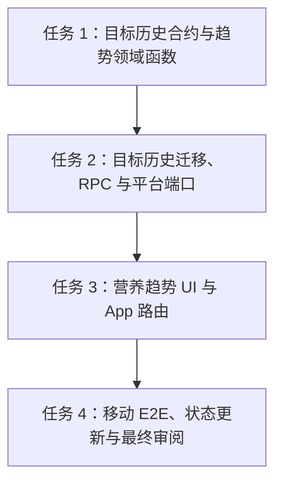

# 架构方案：营养趋势与目标完成率

## 执行元数据

- **Status**：confirmed
- **Workflow Stage**：plan
- **Created**：2026-07-14
- **Updated**：2026-07-15
- **Source Of Truth Until**：任务 7「营养趋势」完成 code、review、提交、推送，并把证据折回 `docs/anvil/plans/2026-07-13-personal-fitness-nutrition-pwa-plan.md`
- **Requirements Source**：`docs/anvil/brainstorms/2026-07-13-personal-fitness-nutrition-pwa.md` 的“趋势”与“营养目标”需求、`docs/anvil/plans/2026-07-13-personal-fitness-nutrition-pwa-plan.md` 任务 7、用户已批准的持续开发目标
- **Compounded Knowledge**：not yet compounded
- **Readiness Path**：`pnpm lint && pnpm typecheck && pnpm test && pnpm build && pnpm test:e2e --project=mobile-chromium --reporter=line`
- **Resume Point**：Task 1–3 已完成并通过聚焦验证、typecheck、lint、diff check；下一步执行 Task 4：移动端 E2E、主计划证据回写、最终审阅、提交推送。真实 CloudBase smoke 仍需用户提供生产/测试环境配置后单独验证，不在本地 test-platform E2E 中伪报通过。

## 模块边界

### 模块：目标历史合约 `packages/contracts/src/nutritionGoals.ts`

- **职责**：定义按日期选择目标所需的只读目标版本 DTO。
- **输入**：CloudBase RPC、test platform 与前端领域函数交换的 JSON。
- **输出**：`NutritionGoalVersion` schema/type，包含 `version`、`effectiveDate`、`targets`、`createdAt`。
- **依赖**：既有 `NutritionTargets` schema/type。
- **不变量**：不包含 `userId`；目标值必须有限且非负；`effectiveDate` 必须是 `YYYY-MM-DD`。

### 模块：营养趋势领域函数 `src/domain/trends/nutritionTrends.ts`

- **职责**：把每日餐食汇总与目标版本转换为日/周趋势点和完成率。
- **输入**：日期范围、每日营养摄入、目标版本。
- **输出**：`DailyNutritionTrendPoint[]`、`WeeklyNutritionTrendPoint[]`、目标选择结果。
- **依赖**：共享合约类型；无 React、CloudBase、localStorage、网络或当前时间依赖。
- **不变量**：同一输入得到同一输出；目标按 `effectiveDate <= date` 的最新版本选择；没有餐食时摄入为 0；没有目标时目标和完成率为 `null`，不伪造 0%。

### 模块：目标历史平台端口 `src/platform/nutritionGoals`

- **职责**：提供 `NutritionGoalsRepository.listByDateRange(startDate, endDate)`，隔离 CloudBase 与 test platform。
- **输入**：闭区间日期。
- **输出**：目标版本数组，至少包含覆盖起始日前的最近一个版本和区间内新增版本。
- **依赖**：共享合约；CloudBase 实现只在 `src/platform/cloudbase`；test 实现只在 `src/platform/testing`。
- **不变量**：客户端命令不携带 `userId`；平台错误映射为稳定错误；读取失败时 UI 可恢复。

### 模块：生产数据库/RPC `cloud/database/migrations/0005_nutrition_goal_history.sql`

- **职责**：为 `nutrition_goals` 增加日期生效语义和只读 RPC。
- **输入**：受控迁移与已认证 RPC。
- **输出**：`effective_date`、索引、固定 search_path definer RPC `list_my_nutrition_goals_by_date_range`，并更新 `save_my_profile_settings` 写入目标版本的生效日期。
- **依赖**：既有 `profiles`、`nutrition_goals`、`auth.uid()`。
- **不变量**：`authenticated` 仍无直接表权限；RPC 不接受 `user_id`；跨用户不可枚举。

### 模块：营养趋势页面 `src/features/nutrition-trends`

- **职责**：移动优先展示 7/28 天热量、蛋白质、脂肪、碳水完成情况，提供日视图和周汇总的可访问文本/表格。
- **输入**：`MealsRepository`、`NutritionGoalsRepository`、用户选择日期范围。
- **输出**：趋势卡片、表格、空状态、加载/错误/可恢复重试。
- **依赖**：平台端口和领域函数。
- **不变量**：不使用 canvas-only 图表；所有数值有文本等价；营养目标仍标注为估算，不构成医疗建议。

### 模块：App 路由 `src/app`

- **职责**：把 `/nutrition-trends` 接入鉴权路由与平台加载。
- **输入**：auth、meals、nutritionGoals。
- **输出**：受保护趋势页面或可恢复平台加载错误。
- **依赖**：既有 AuthGate 与平台 loader。
- **不变量**：未登录不能看到用户趋势；CloudBase 配置缺失时失败关闭；test platform 只在显式 `?test-platform=1` 下加载。

## 接口定义

```ts
export interface NutritionGoalVersion {
  version: number;
  effectiveDate: string;
  targets: NutritionTargets;
  createdAt: string;
}

export interface NutritionGoalsRepository {
  listByDateRange(startDate: string, endDate: string): Promise<NutritionGoalVersion[]>;
}

export interface DailyNutritionTrendPoint {
  date: string;
  consumed: MealNutritionTotals;
  target: NutritionTargets | null;
  completion: {
    calories: number | null;
    protein: number | null;
    fat: number | null;
    carbs: number | null;
  };
}
```

## 日志规范

前端本切片不新增生产日志。CloudBase/RPC 层若沿用平台错误处理，只返回稳定错误码；不得记录用户邮箱、餐食备注、完整目标 payload 或 userId。测试日志只保留命令结果。

## RTK 过滤预设

- 合约/领域：`pnpm_config_verify_deps_before_run=warn pnpm vitest run packages/contracts/src/nutritionGoals.test.ts src/domain/trends/nutritionTrends.test.ts`
- 平台/迁移：`pnpm_config_verify_deps_before_run=warn pnpm vitest run src/platform/cloudbase/CloudBaseNutritionGoalsRepository.test.ts src/platform/testing/createTestPlatform.test.ts tests/security/nutritionGoalHistoryIsolation.test.ts tests/security/migrationShape.test.ts`
- UI/App：`pnpm_config_verify_deps_before_run=warn pnpm vitest run src/features/nutrition-trends/NutritionTrendsPage.test.tsx src/app/App.test.tsx`
- E2E：`pnpm_config_verify_deps_before_run=warn pnpm test:e2e --project=mobile-chromium --reporter=line tests/e2e/nutrition-trends.spec.ts`
- 全量：`pnpm_config_verify_deps_before_run=warn pnpm lint && pnpm_config_verify_deps_before_run=warn pnpm typecheck && pnpm_config_verify_deps_before_run=warn pnpm test && pnpm_config_verify_deps_before_run=warn pnpm build`

## 历史经验约束

- `docs/solutions` 当前不存在，未检索到项目级历史知识库。
- 继承本项目已形成的 Anvil 约束：用户拥有的数据必须按会话用户隔离；浏览器代码不得包含服务端密钥；营养结果展示为估算且非医疗建议；真实 CloudBase smoke 缺环境时必须明确 blocker，不伪报通过。

## 关键模式检查

- ❌ 用当前目标套所有历史日期；✅ 每个日期选择 `effectiveDate <= date` 的最新目标版本。
- ❌ 缺少目标时把完成率显示为 0%；✅ 显示“暂无目标”，完成率为不可计算。
- ❌ 直接从前端读取 `nutrition_goals` 表或传 `userId`；✅ 只走 auth-only definer RPC / test platform 会话。
- ❌ 只提供颜色或图形表达趋势；✅ 表格/文本提供同等信息，适配屏幕阅读器。
- ❌ 为趋势引入大型图表库导致首屏负担；✅ 首版用轻量 CSS 条形和表格，综合图表留给任务 8。

## 简化审计

- 不做任意自定义日期范围，只提供以选中结束日回看 7 天/28 天。
- 不新增图表依赖，不做交互式缩放、导出、预测或教练建议。
- 不新增餐食范围 RPC；首版个人规模下由页面按日期调用既有 `meals.listByDate`，任务 9 性能验收再决定是否合并查询。
- 只展示营养趋势，不混入体重或训练趋势；综合趋势归任务 8。

## 任务 DAG



## 并行执行计划

| Layer | Parallel Group | Tasks | Execution | Reason |
|-------|----------------|-------|-----------|--------|
| 1 | G1 | 任务 1 | serial | 新增共享合约和领域公共类型 |
| 2 | G2 | 任务 2 | serial | 修改数据库迁移、RPC、平台 shape 和 test platform |
| 3 | G3 | 任务 3 | serial | 组合新平台端口、页面和全局路由 |
| 4 | G4 | 任务 4 | serial | 全量验证、状态回写、最终审阅和提交推送 |

## 任务列表

### 任务 1：目标历史合约与趋势领域函数

- **Layer**：1
- **Parallel Group**：G1
- **Execution**：serial
- **Parallel Blocker**：共享合约和领域类型
- **Ownership**：`packages/contracts/src/nutritionGoals.ts`、`packages/contracts/src/nutritionGoals.test.ts`、`packages/contracts/src/index.ts`、`src/domain/trends/**`
- **Read Set**：`packages/contracts/src/profileSettings.ts`、`packages/contracts/src/meals.ts`、`src/domain/meals/**`
- **Write Set**：同 Ownership
- **描述**：定义目标版本 DTO，并实现日/周营养趋势纯函数。
- **成功标准**：schema 拒绝额外字段、坏日期、非整数版本、负目标；领域函数正确处理空餐食、无目标、单目标、跨目标版本、部分周和完整周。
- **预估 Token**：70k
- **依赖**：任务 3 手动餐食闭环和任务 2 目标版本表已存在
- **涉及文件**：
  - Create `packages/contracts/src/nutritionGoals.ts`
  - Create `packages/contracts/src/nutritionGoals.test.ts`
  - Modify `packages/contracts/src/index.ts`
  - Create `src/domain/trends/nutritionTrends.ts`
  - Create `src/domain/trends/nutritionTrends.test.ts`
  - Create `src/domain/trends/index.ts`
- **Code Status**：done
- **Actual Write Set**：
  - `packages/contracts/src/nutritionGoals.ts`
  - `packages/contracts/src/nutritionGoals.test.ts`
  - `packages/contracts/src/index.ts`
  - `src/domain/trends/nutritionTrends.ts`
  - `src/domain/trends/nutritionTrends.test.ts`
  - `src/domain/trends/index.ts`
- **Accepted Change Baseline**：
  - 新增严格 `NutritionGoalVersion` 合约，包含 `version`、`effectiveDate`、`targets`、`createdAt`，拒绝 `userId`、坏日期、非正整数版本、负目标、非有限目标和额外 target key。
  - 新增纯领域函数 `selectGoalForDate`、`buildDailyNutritionTrend`、`buildWeeklyNutritionTrend`；目标按 `effectiveDate <= date` 最新版本选择；无目标时目标和完成率均为 `null`；无餐食日摄入为 0；周汇总按连续 7 天分组并累加每日目标。
  - 新增 `src/domain/trends/index.ts` 和 contracts barrel export，供后续平台/UI 任务消费。
- **Verification**：
  - RED：`pnpm_config_verify_deps_before_run=warn pnpm vitest run packages/contracts/src/nutritionGoals.test.ts src/domain/trends/nutritionTrends.test.ts` 先因 `./nutritionGoals` 和 `./nutritionTrends` 不存在失败。
  - GREEN：同命令通过，2 个测试文件、12 条测试通过。
  - `pnpm_config_verify_deps_before_run=warn pnpm typecheck` 通过。
  - `pnpm_config_verify_deps_before_run=warn pnpm lint` 通过。
  - `git diff --check` 通过。
- **Evidence**：评审报告 `.ai/anvil/reviews/2026-07-14-nutrition-trends-domain-review.md`，结论 `APPROVED`；无 Critical/High 未解决问题。
- **执行指令**：
  1. 先写 RED 测试，覆盖 schema 严格性、`selectGoalForDate`、7 天日趋势、周汇总和无目标行为。
  2. 运行 RED：`pnpm_config_verify_deps_before_run=warn pnpm vitest run packages/contracts/src/nutritionGoals.test.ts src/domain/trends/nutritionTrends.test.ts`。
  3. 实现 schema 和纯函数。完成率公式为 `consumed / target`，目标为 0 或缺失时返回 `null`。
  4. 运行 GREEN。

### 任务 2：目标历史迁移、RPC 与平台端口

- **Layer**：2
- **Parallel Group**：G2
- **Execution**：serial
- **Parallel Blocker**：生产安全边界、迁移和平台 shape
- **Ownership**：`cloud/database/migrations/0005_nutrition_goal_history.sql`、`tests/security/nutritionGoalHistoryIsolation.test.ts`、`tests/security/migrationShape.test.ts`、`src/platform/nutritionGoals/**`、`src/platform/cloudbase/CloudBaseNutritionGoalsRepository.*`、`src/platform/cloudbase/createCloudBasePlatform.ts`、`src/platform/cloudbase/index.ts`、`src/platform/testing/createTestPlatform.*`
- **Read Set**：`cloud/database/migrations/0001_profiles_and_nutrition_goals.sql`、`src/platform/cloudbase/CloudBaseProfileSettingsRepository.*`、`src/platform/testing/createTestPlatform.ts`、Task 1 合约
- **Write Set**：同 Ownership
- **描述**：为目标历史提供按日期范围读取能力，并接入 CloudBase/test platform。
- **成功标准**：A/B 用户目标历史互不可读；`authenticated` 仍无直接表权限；RPC 固定 search_path、auth-only、无 `user_id` 参数；保存新 profile 时生成当日 effective goal；平台 adapter 不暴露 provider detail。
- **预估 Token**：110k
- **依赖**：Task 1
- **涉及文件**：
  - Create `cloud/database/migrations/0005_nutrition_goal_history.sql`
  - Create `tests/security/nutritionGoalHistoryIsolation.test.ts`
  - Modify `tests/security/migrationShape.test.ts`
  - Create `src/platform/nutritionGoals/NutritionGoalsRepository.ts`
  - Create `src/platform/nutritionGoals/index.ts`
  - Create `src/platform/cloudbase/CloudBaseNutritionGoalsRepository.test.ts`
  - Create `src/platform/cloudbase/CloudBaseNutritionGoalsRepository.ts`
  - Modify `src/platform/cloudbase/createCloudBasePlatform.ts`
  - Modify `src/platform/cloudbase/index.ts`
  - Modify `src/platform/testing/createTestPlatform.ts`
  - Modify `src/platform/testing/createTestPlatform.test.ts`
- **Code Status**：done
- **Actual Write Set**：
  - `cloud/database/migrations/0005_nutrition_goal_history.sql`
  - `tests/security/nutritionGoalHistoryIsolation.test.ts`
  - `tests/security/migrationShape.test.ts`
  - `tests/security/pgliteAuthHarness.ts`
  - `src/platform/nutritionGoals/NutritionGoalsRepository.ts`
  - `src/platform/nutritionGoals/index.ts`
  - `src/platform/cloudbase/CloudBaseNutritionGoalsRepository.test.ts`
  - `src/platform/cloudbase/CloudBaseNutritionGoalsRepository.ts`
  - `src/platform/cloudbase/createCloudBasePlatform.ts`
  - `src/platform/cloudbase/createCloudBasePlatform.test.ts`
  - `src/platform/cloudbase/index.ts`
  - `src/platform/testing/createTestPlatform.ts`
  - `src/platform/testing/createTestPlatform.test.ts`
- **Accepted Change Baseline**：
  - 新增 `nutrition_goals.effective_date`、按用户/生效日期索引和 auth-only definer RPC `list_my_nutrition_goals_by_date_range(start_date, end_date)`；RPC 返回当前用户在范围内的目标版本，并包含覆盖起始日前的最近版本。
  - 新增 `NutritionGoalsRepository` 端口和 `CloudBaseNutritionGoalsRepository`；客户端只传 `start_date/end_date`，不传 `userId`，provider 错误统一映射为 `NutritionGoalsRepositoryError`。
  - `createCloudBasePlatform` 非枚举暴露 `nutritionGoals`，继续隐藏 raw SDK/RDB。
  - test platform 在已登录 profile save 时记录每用户隔离的内存目标历史；未登录 legacy payload 检查不写用户历史。
- **Verification**：
  - RED：`pnpm_config_verify_deps_before_run=warn pnpm vitest run tests/security/nutritionGoalHistoryIsolation.test.ts tests/security/migrationShape.test.ts src/platform/cloudbase/CloudBaseNutritionGoalsRepository.test.ts src/platform/cloudbase/createCloudBasePlatform.test.ts src/platform/testing/createTestPlatform.test.ts` 先因 `effective_date`、`list_my_nutrition_goals_by_date_range`、`CloudBaseNutritionGoalsRepository` 和 `platform.nutritionGoals` 不存在失败。
  - GREEN：同命令通过，5 个测试文件、22 条测试通过。
  - `pnpm_config_verify_deps_before_run=warn pnpm typecheck` 通过。
  - `pnpm_config_verify_deps_before_run=warn pnpm lint` 通过。
  - `git diff --check` 通过。
- **Evidence**：评审报告 `.ai/anvil/reviews/2026-07-14-nutrition-trends-platform-review.md`，结论 `APPROVED`；无 Critical/High 未解决问题。
- **执行指令**：
  1. 写 RED：PGlite 验证 `list_my_nutrition_goals_by_date_range` 只返回当前用户、包含起始日前最近版本、拒绝坏日期/反向日期；平台测试断言 CloudBase RPC 参数和错误脱敏。
  2. 运行 RED：`pnpm_config_verify_deps_before_run=warn pnpm vitest run tests/security/nutritionGoalHistoryIsolation.test.ts tests/security/migrationShape.test.ts src/platform/cloudbase/CloudBaseNutritionGoalsRepository.test.ts src/platform/testing/createTestPlatform.test.ts`。
  3. 迁移新增 `effective_date date`，回填 `created_at::date`，索引 `(user_id, effective_date DESC, version DESC)`；`CREATE OR REPLACE FUNCTION save_my_profile_settings` 写入 `effective_date = current_date`；新增 `list_my_nutrition_goals_by_date_range(start_date text, end_date text)`。
  4. 实现 `NutritionGoalsRepository`、CloudBase adapter 和 test platform 内存目标历史。
  5. 运行 GREEN、typecheck、lint、diff check。

### 任务 3：营养趋势 UI 与 App 路由

- **Layer**：3
- **Parallel Group**：G3
- **Execution**：serial
- **Parallel Blocker**：组合平台端口、页面和全局路由
- **Ownership**：`src/features/nutrition-trends/**`、`src/app/App.tsx`、`src/app/App.test.tsx`
- **Read Set**：Task 1–2 输出、`src/features/today/**`、`src/features/auth/**`
- **Write Set**：同 Ownership
- **描述**：实现 `/nutrition-trends` 鉴权页面，展示 7/28 天日趋势和周汇总。
- **成功标准**：未登录看到登录页；登录后加载餐食与目标历史；空数据显示可理解空状态；有部分日数据时进度正确；跨目标版本日期显示对应目标；错误可重试且不丢旧数据。
- **预估 Token**：100k
- **依赖**：Task 2
- **涉及文件**：
  - Create `src/features/nutrition-trends/NutritionTrendsPage.test.tsx`
  - Create `src/features/nutrition-trends/NutritionTrendsPage.tsx`
  - Create `src/features/nutrition-trends/nutritionTrends.css`
  - Create `src/features/nutrition-trends/index.ts`
  - Modify `src/app/App.tsx`
  - Modify `src/app/App.test.tsx`
- **Code Status**：done
- **Actual Write Set**：
  - `src/features/nutrition-trends/NutritionTrendsPage.test.tsx`
  - `src/features/nutrition-trends/NutritionTrendsPage.tsx`
  - `src/features/nutrition-trends/nutritionTrends.css`
  - `src/features/nutrition-trends/index.ts`
  - `src/app/App.tsx`
  - `src/app/App.test.tsx`
- **Accepted Change Baseline**：
  - 新增 `/nutrition-trends` 鉴权页面，默认以本地日期为结束日，支持回看近 7 天/28 天。
  - 页面通过 `MealsRepository` 和 `NutritionGoalsRepository` 读取每日摄入和目标历史，复用领域函数生成日趋势与周汇总，不在 UI 中直接读取 CloudBase 表或传 `userId`。
  - 页面以可访问表格和轻量 CSS 进度条展示热量目标完成率；无目标时显示“暂无目标”和“—”，不伪造 0%；文案明确“目标和摄入均为估算，不构成医疗建议。”。
  - App 平台 shape 接入 `nutritionGoals`，`/nutrition-trends` 在未登录时显示登录页，CloudBase 缺配置/加载失败时失败关闭并提供既有可恢复路径。
- **Verification**：
  - RED：`pnpm_config_verify_deps_before_run=warn pnpm vitest run src/features/nutrition-trends/NutritionTrendsPage.test.tsx src/app/App.test.tsx` 先因 `NutritionTrendsPage` 和 `/nutrition-trends` route 不存在失败。
  - GREEN：同命令通过，2 个测试文件、22 条测试通过。
  - `pnpm_config_verify_deps_before_run=warn pnpm typecheck` 通过。
  - `pnpm_config_verify_deps_before_run=warn pnpm lint` 通过。
  - `git diff --check` 通过。
- **Evidence**：评审报告 `.ai/anvil/reviews/2026-07-15-nutrition-trends-ui-review.md`，结论 `APPROVED`；无 Critical/High 未解决问题。
- **执行指令**：
  1. 写失败组件测试：无目标、空餐食、单日/多日摄入、目标版本切换、加载失败重试、路由鉴权。
  2. 运行 RED：`pnpm_config_verify_deps_before_run=warn pnpm vitest run src/features/nutrition-trends/NutritionTrendsPage.test.tsx src/app/App.test.tsx`。
  3. 实现页面：默认结束日为今天，范围按钮 7/28 天；用文本表格和轻量进度条；文案包含“目标和摄入均为估算，不构成医疗建议”。
  4. 运行 GREEN、typecheck、lint、diff check。

### 任务 4：移动 E2E、状态更新与最终审阅

- **Layer**：4
- **Parallel Group**：G4
- **Execution**：serial
- **Parallel Blocker**：全量验证和 Anvil 状态更新
- **Ownership**：`tests/e2e/nutrition-trends.spec.ts`、`docs/anvil/plans/2026-07-13-personal-fitness-nutrition-pwa-plan.md`、本计划文档、`.ai/anvil/reviews/*`
- **Read Set**：Task 1–3 输出、既有 E2E 模式
- **Write Set**：同 Ownership
- **描述**：新增移动端 test-platform E2E，更新主计划证据，完成最终审阅和保护性提交。
- **成功标准**：E2E 覆盖登录、进入 `/nutrition-trends?test-platform=1`、创建/读取可验证餐食和目标、看到 7 天营养趋势与周汇总；全量 lint/typecheck/test/build/E2E 通过；真实 CloudBase smoke blocker 继续明确。
- **预估 Token**：70k
- **依赖**：Task 3
- **涉及文件**：
  - Create `tests/e2e/nutrition-trends.spec.ts`
  - Modify `docs/anvil/plans/2026-07-13-personal-fitness-nutrition-pwa-plan.md`
  - Modify `docs/anvil/plans/2026-07-14-nutrition-trends-plan.md`
  - Add `.ai/anvil/reviews/2026-07-14-nutrition-trends-final-review.md`
- **执行指令**：
  1. 写失败 E2E，使用 test platform route，不依赖真实 CloudBase 或生产密钥。
  2. 运行 RED：`pnpm_config_verify_deps_before_run=warn pnpm test:e2e --project=mobile-chromium --reporter=line tests/e2e/nutrition-trends.spec.ts`。
  3. 补齐实现后运行 focused E2E，再运行全量 readiness path。
  4. 更新主计划 Task 7 `Code Status`、`Actual Write Set`、`Verification`、`Evidence` 和 `Resume Point`。
  5. 完成 Anvil review；无 Critical/High 后提交并推送。

## 会话拆分点

- 拆分点 1：Task 1 完成后，趋势核心算法可独立验证。
- 拆分点 2：Task 2 完成后，目标历史读模型和权限边界已稳定。
- 拆分点 3：Task 3 完成后，趋势页面可在组件测试中闭环。
- 拆分点 4：Task 4 完成后，本切片可提交推送并进入任务 8 综合趋势。

## 通过条件

- [x] 模块边界清晰，合约、领域、平台、迁移和 UI 职责不穿透。
- [x] Simplicity First：不引入图表库、不做任意日期范围、不做综合趋势。
- [x] 目标历史按日期选择，不使用当前目标覆盖历史。
- [x] 缺目标时不伪造完成率。
- [x] 客户端不传 `userId`，生产读取走 auth-only definer RPC。
- [x] 每个任务有明确 Ownership、Read Set、Write Set 和验证命令。
- [x] 迁移、安全、平台 shape 和全局 App 路由均串行执行。
- [x] 真实 CloudBase blocker 有 owner 和 next step，不伪报通过。
- [x] 没有创建 `.ai/anvil/tasks/*`、JSON 状态文件或第二任务状态系统。
