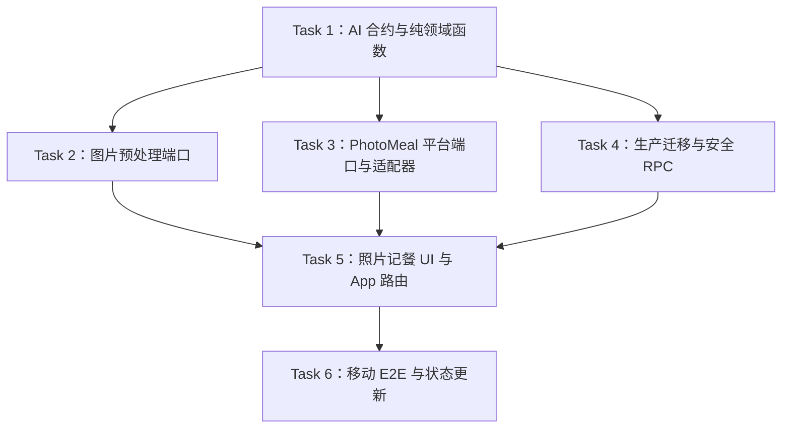

# 架构方案：图片餐食分析、人工确认与失败恢复

## 执行元数据

- **Status**：active
- **Workflow Stage**：code
- **Created**：2026-07-14
- **Updated**：2026-07-14
- **Source Of Truth Until**：图片餐食分析切片完成 code、review、提交、推送，并把证据折回 `docs/anvil/plans/2026-07-13-personal-fitness-nutrition-pwa-plan.md`
- **Requirements Source**：`docs/anvil/brainstorms/2026-07-13-personal-fitness-nutrition-pwa.md` 的“图片识别”需求、`docs/anvil/plans/2026-07-13-personal-fitness-nutrition-pwa-plan.md` 任务 6、用户已批准的方案 A 与大陆网络约束
- **Compounded Knowledge**：not yet compounded
- **Readiness Path**：`pnpm lint && pnpm typecheck && pnpm test && pnpm build && pnpm test:e2e --project=mobile-chromium --reporter=line`
- **Resume Point**：Task 1 已提交推送；Task 2 已完成代码、聚焦验证和 Anvil 审阅，待保护性提交/推送后继续 Task 3：PhotoMeal 平台端口与 CloudBase/test adapters。真实 CloudBase 视觉模型 smoke 在隔离环境、服务端模型配置和测试图片策略准备前保持 blocked；本地自动化先使用固定夹具和 test platform。

## 模块边界

### 模块：共享合约 `packages/contracts/src/photoMeal.ts`

- **职责**：定义图片餐食分析请求、候选食物、分析状态、确认输入和安全错误响应 schema。
- **输入**：浏览器、test platform、Cloud Function 与数据库 RPC 之间交换的 JSON。
- **输出**：严格 Zod schema 与 TypeScript 类型。
- **依赖**：只依赖 `zod` 和既有 `MealNutritionTotals`。
- **不变量**：分析结果必须是可编辑估算；不得包含 `userId`、模型密钥、签名 URL、原始 provider 错误或图片二进制。

### 模块：领域函数 `src/domain/photoMeal`

- **职责**：把模型候选项规整为可编辑餐食草稿，计算确认候选的合计营养，判断低置信度和补充问题。
- **输入**：已通过合约校验的 `PhotoMealAnalysis` 或候选项数组。
- **输出**：纯计算结果，例如 `editableItems`、`totals`、`needsUserInput`。
- **依赖**：共享合约；无浏览器、CloudBase、网络或当前时间依赖。
- **不变量**：同一输入得到同一输出；只统计用户保留的候选项；不会创建正式餐食。

### 模块：图片预处理 `src/platform/image`

- **职责**：在浏览器端读取图片、限制格式、缩放压缩为 WebP/JPEG data URL，并报告可恢复错误。
- **输入**：`File`、压缩参数。
- **输出**：`PreparedMealPhoto = { dataUrl, mimeType, sizeBytes, width, height, originalName }`。
- **依赖**：浏览器 `FileReader`、`Image`、`canvas`；测试中使用可注入的 image/canvas adapters。
- **不变量**：最长边 ≤ 1600 px，输出 ≤ 1.5 MB；不写入 localStorage，不上传原图，不记录图片内容。

### 模块：AI 分析端口 `src/platform/photoMeal`

- **职责**：提供前端可调用的 `PhotoMealAnalysisRepository`，隔离 test platform 与 CloudBase 实现。
- **输入**：`create({ mealDate, requestId, photo })`、`get(id)`、`confirm({ analysisId, mealDate, items })`、`discard(id)`。
- **输出**：`PhotoMealAnalysis`、确认后的 `MealEntry[]`。
- **依赖**：共享合约；CloudBase 实现只在 `src/platform/cloudbase`；test platform 只在 `src/platform/testing`。
- **不变量**：客户端命令不携带 `userId`；所有 provider 错误映射为稳定中文可恢复错误；确认前不调用正式餐次写入。

### 模块：CloudBase 服务端代理 `cloud/functions/meal-photo-analysis`

- **职责**：认证用户、私有保存压缩图、创建/读取/确认/丢弃 AI 分析、调用国内视觉模型、严格校验模型 JSON、失败重试一次。
- **输入**：CloudBase 已认证请求、压缩图片 data URL、requestId、确认候选项。
- **输出**：安全 JSON 响应；确认时事务写入 `meals`。
- **依赖**：CloudBase 云函数运行时、PostgreSQL、私有存储、服务端模型配置。
- **不变量**：服务端密钥只在云函数环境；日志不含照片、签名 URL、模型密钥、邮箱、验证码或自由文本备注全文。

### 模块：生产数据库 `cloud/database/migrations/0004_photo_meal_analysis.sql`

- **职责**：新增 `ai_analyses` 表、按用户隔离、请求去重、确认事务 RPC 和孤儿清理标记。
- **输入**：受控迁移。
- **输出**：可重复验证的表、索引、RLS、无直接表权限、固定 search_path definer RPC。
- **依赖**：既有 `meals` 表和 `auth.uid()`。
- **不变量**：`authenticated` 不能直接读写 `ai_analyses`；RPC 不接受 `user_id`；确认失败完全回滚，日汇总不变化。

### 模块：照片记餐页面 `src/features/photo-meal`

- **职责**：提供拍照/相册入口、首次第三方模型提示、上传/分析状态、可编辑候选项、补充问题、确认或转手动录入。
- **输入**：`PhotoMealAnalysisRepository`、`MealsRepository` 用于返回今日页刷新、用户交互。
- **输出**：用户确认后的正式餐食、可恢复错误和空状态。
- **依赖**：平台端口、领域函数、共享合约。
- **不变量**：AI 估算结果在确认前不影响今日汇总；所有营养结果以“可编辑估算，不构成医疗建议”呈现。

## 接口定义

```ts
export interface PhotoMealCandidate {
  id: string;
  name: string;
  estimatedGrams: number;
  cookingMethod: string;
  nutrition: MealNutritionTotals;
  confidence: number;
  questions: string[];
}

export interface PhotoMealAnalysis {
  id: string;
  mealDate: string;
  requestId: string;
  status: 'processing' | 'needs-confirmation' | 'failed' | 'confirmed' | 'discarded';
  candidates: PhotoMealCandidate[];
  overallConfidence: number;
  questions: string[];
  imageObjectKey: string;
  errorCode: string | null;
  createdAt: string;
  updatedAt: string;
}

export interface PreparedMealPhoto {
  dataUrl: string;
  mimeType: 'image/jpeg' | 'image/webp';
  sizeBytes: number;
  width: number;
  height: number;
  originalName: string;
}

export interface PhotoMealAnalysisRepository {
  create(input: { mealDate: string; requestId: string; photo: PreparedMealPhoto }): Promise<PhotoMealAnalysis>;
  get(id: string): Promise<PhotoMealAnalysis>;
  confirm(input: {
    analysisId: string;
    mealDate: string;
    items: PhotoMealCandidate[];
  }): Promise<MealEntry[]>;
  discard(id: string): Promise<void>;
}
```

CloudBase 浏览器适配器调用云函数，不直接调用模型或私有存储管理接口。云函数内部使用服务端配置：

- `PHOTO_MEAL_MODEL_PROVIDER`
- `PHOTO_MEAL_MODEL_NAME`
- `PHOTO_MEAL_DAILY_LIMIT`，默认 20
- 模型 API 密钥或 CloudBase AI 服务凭据，禁止任何 `VITE_` 前缀

## 日志规范

所有图片分析日志使用既有 `AppLog` 字段，新增事件名：

- `photo_meal.image_prepared`
- `photo_meal.analysis_created`
- `photo_meal.model_retry`
- `photo_meal.analysis_failed`
- `photo_meal.analysis_confirmed`
- `photo_meal.analysis_discarded`
- `photo_meal.orphan_cleanup_marked`

允许字段：`requestId`、`entityType: 'photoMealAnalysis' | 'meal'`、`entityId`、`durationMs`、`outcome`、`errorCode`、脱敏 `userIdHash`。禁止字段：照片 data URL、图片对象 key 的签名 URL、模型响应原文、邮箱、验证码、模型密钥、用户备注全文。

## RTK 过滤预设

- 合约/领域：`pnpm_config_verify_deps_before_run=warn pnpm vitest run packages/contracts/src/photoMeal.test.ts src/domain/photoMeal/photoMealAnalysis.test.ts`
- 图片预处理：`pnpm_config_verify_deps_before_run=warn pnpm vitest run src/platform/image/prepareMealPhoto.test.ts`
- 平台适配器：`pnpm_config_verify_deps_before_run=warn pnpm vitest run src/platform/testing/createTestPlatform.test.ts src/platform/cloudbase/CloudBasePhotoMealAnalysisRepository.test.ts`
- 迁移安全：`pnpm_config_verify_deps_before_run=warn pnpm vitest run tests/security/photoMealAnalysisIsolation.test.ts tests/security/migrationShape.test.ts`
- UI/App：`pnpm_config_verify_deps_before_run=warn pnpm vitest run src/features/photo-meal/PhotoMealPage.test.tsx src/app/App.test.tsx`
- E2E：`pnpm_config_verify_deps_before_run=warn pnpm test:e2e --project=mobile-chromium --reporter=line tests/e2e/photo-meal.spec.ts`
- 全量：`pnpm_config_verify_deps_before_run=warn pnpm lint && pnpm_config_verify_deps_before_run=warn pnpm typecheck && pnpm_config_verify_deps_before_run=warn pnpm test && pnpm_config_verify_deps_before_run=warn pnpm build && pnpm_config_verify_deps_before_run=warn pnpm test:e2e --project=mobile-chromium --reporter=line && git diff --check`

## 历史经验约束

当前仓库没有 `docs/solutions` 历史知识库。沿用已在本项目多次验证的约束：

- 页面只依赖平台端口，不能直接导入 CloudBase SDK。
- CloudBase 适配器不得泄露 provider 原始错误。
- 生产迁移中 `authenticated` 不具有用户表直接权限，只能执行 auth-only definer RPC。
- test platform 以 `current-user` 作为隔离来源，不能从客户端命令接收 `userId`。
- E2E 使用 `?test-platform=1`，真实 CloudBase manual spec 只在隔离环境显式开启。

## 关键模式检查

- ❌ AI 返回直接写 `meals`；✅ `ai_analyses` 先保存临时结果，用户确认后事务写入正式餐食。
- ❌ 浏览器持有模型密钥或服务端存储密钥；✅ 浏览器只发送压缩图到云函数，模型与私有存储凭据只在服务端。
- ❌ 失败后创建半成品餐食；✅ 失败只更新分析状态，`meals` 行数与今日汇总保持不变。
- ❌ 前端以隐藏字段传 `userId`；✅ 所有服务端读写从 CloudBase 会话 / `auth.uid()` 绑定用户。
- ❌ 长期公开图片 URL 传给模型；✅ 服务端使用短时授权或 CloudBase 内部读取。
- ❌ Service Worker runtime cache 用户照片/API；✅ 继续保持只预缓存静态外壳。
- ❌ 低置信度静默保存；✅ UI 显示不确定标记、问题和可编辑表单，用户明确确认。

## 简化审计

- 首版只实现一张图对应一组候选食物；不做批量多图、条形码、餐厅菜单 OCR 或自动食谱。
- 首版确认时把每个候选食物创建为正式 `MealEntry`，复用当前 `meals` 模型；不在本切片引入完整 `food_items` 表，避免推翻已验证的手动餐食闭环。
- 首版只保留“重试一次模型 JSON 校验失败”的服务端逻辑；不做后台队列或长轮询。
- 首版不把 AI 分析接入趋势图；趋势切片读取已确认的 `meals` 即可。
- 删除上述能力后仍满足“拍照估算、用户编辑、确认入账、失败不入账”的核心需求。

## 任务 DAG



## 并行执行计划

| Layer | Parallel Group | Tasks | Execution | Reason |
|---|---|---|---|---|
| 1 | G1 | Task 1 | serial | 共享合约和类型是后续任务依赖 |
| 2 | G2A | Task 2 | serial | 浏览器图片预处理与 UI 相关，依赖合约 |
| 2 | G2B | Task 3 | serial | 平台端口影响 App platform shape 和 CloudBase adapter |
| 2 | G2C | Task 4 | serial | 生产迁移、RLS、RPC 是共享安全边界，必须独立审查 |
| 3 | G3 | Task 5 | serial | UI 组合图片预处理、分析端口、确认流程和 App 路由 |
| 4 | G4 | Task 6 | serial | 全量 E2E、状态文档和最终审阅 |

本切片全部串行执行。原因：合约、平台 shape、迁移和 UI 彼此依赖，且都影响安全边界。

## 任务列表

### Task 1：AI 合约与纯领域函数

- **Layer**：1
- **Parallel Group**：G1
- **Execution**：serial
- **Parallel Blocker**：共享接口和类型
- **Ownership**：`packages/contracts/src/photoMeal.ts`、`packages/contracts/src/photoMeal.test.ts`、`packages/contracts/src/index.ts`、`src/domain/photoMeal/**`
- **Read Set**：`packages/contracts/src/meals.ts`、`src/domain/meals/**`、需求文档图片识别部分
- **Write Set**：同 Ownership
- **描述**：定义图片分析 DTO、候选食物、确认输入、状态机和纯函数。
- **成功标准**：Zod 严格拒绝额外字段、坏日期、空食物名、负克数、负营养、置信度越界、图片对象 key 泄露为 URL；纯函数只统计保留候选项并正确识别低置信度。
- **预估 Token**：70k
- **依赖**：任务 3 手动餐食合约已完成
- **涉及文件**：
  - Create `packages/contracts/src/photoMeal.ts`
  - Create `packages/contracts/src/photoMeal.test.ts`
  - Modify `packages/contracts/src/index.ts`
  - Create `src/domain/photoMeal/photoMealAnalysis.ts`
  - Create `src/domain/photoMeal/photoMealAnalysis.test.ts`
  - Create `src/domain/photoMeal/index.ts`
- **Code Status**：done
- **Actual Write Set**：
  - `packages/contracts/src/photoMeal.ts`
  - `packages/contracts/src/photoMeal.test.ts`
  - `packages/contracts/src/index.ts`
  - `src/domain/photoMeal/photoMealAnalysis.ts`
  - `src/domain/photoMeal/photoMealAnalysis.test.ts`
  - `src/domain/photoMeal/index.ts`
- **Accepted Change Baseline**：
  - 新增严格 `PhotoMealCandidate`、`PhotoMealAnalysis`、`PreparedMealPhoto`、创建/确认输入与确认结果 schema；客户端输入不包含 `userId`；图片对象 key 只接受 `users/` 私有对象 key 且拒绝 URL、查询串和 fragment。
  - `PreparedMealPhoto` 限制 JPEG/WebP data URL、整数尺寸、最大 1.5 MB，并要求 data URL MIME 与 `mimeType` 一致。
  - 新增纯函数 `calculateCandidateTotals`、`analysisNeedsUserInput`、`candidateToMealInput`，无浏览器、CloudBase、网络、时间或持久化依赖。
- **Verification**：
  - RED：`pnpm_config_verify_deps_before_run=warn pnpm vitest run packages/contracts/src/photoMeal.test.ts src/domain/photoMeal/photoMealAnalysis.test.ts` 先因 `./photoMeal` 和 `./photoMealAnalysis` 不存在失败。
  - MIME 一致性补强 RED：同命令先出现 `rejects mismatched image data url mime type` 失败。
  - GREEN：同命令通过，2 个测试文件、20 条测试通过。
  - `pnpm_config_verify_deps_before_run=warn pnpm typecheck` 通过。
  - `pnpm_config_verify_deps_before_run=warn pnpm lint` 通过。
  - `git diff --check` 通过。
- **Evidence**：评审报告 `.ai/anvil/reviews/2026-07-14-photo-meal-contracts-review.md`，结论 `APPROVED`；无 Critical/High 未解决问题。
- **执行指令**：
  1. 先写失败测试，覆盖正常分析、低置信度、失败状态、确认输入、额外 key、坏营养值和 URL 形态的 `imageObjectKey`。
  2. 运行 RED：`pnpm_config_verify_deps_before_run=warn pnpm vitest run packages/contracts/src/photoMeal.test.ts src/domain/photoMeal/photoMealAnalysis.test.ts`，预期因文件不存在失败。
  3. 实现严格 Zod schema。约束：日期 `/^\d{4}-\d{2}-\d{2}$/`；候选名 1..80；烹饪方式 0..80；克数 `0..5000`；营养非负且有限；置信度 `0..1`；问题最多 5 条且每条 1..120；候选最多 12 个；`imageObjectKey` 必须以 `users/` 开头且不得包含 `http://` 或 `https://`。
  4. 实现 `calculateCandidateTotals(candidates)`、`analysisNeedsUserInput(analysis)`、`candidateToMealInput(candidate, mealDate)`。
  5. 运行 GREEN，同 RED 命令，预期通过。

### Task 2：浏览器图片预处理端口

- **Layer**：2
- **Parallel Group**：G2A
- **Execution**：serial
- **Parallel Blocker**：UI 依赖输出 shape，测试需要浏览器环境
- **Ownership**：`src/platform/image/**`
- **Read Set**：Task 1 合约、`docs/operations/local-development.md`
- **Write Set**：同 Ownership
- **描述**：把用户选择的图片压缩为可发送给云函数的安全 data URL，并封装错误。
- **成功标准**：非图片文件拒绝；超过 1.5 MB 的压缩结果拒绝；横图/竖图最长边压到 1600；输出只含 data URL、mime、size、width、height、原始文件名；错误不包含本地路径或图片内容。
- **预估 Token**：60k
- **依赖**：Task 1
- **涉及文件**：
  - Create `src/platform/image/prepareMealPhoto.ts`
  - Create `src/platform/image/prepareMealPhoto.test.ts`
  - Create `src/platform/image/index.ts`
- **Code Status**：done
- **Actual Write Set**：
  - `src/platform/image/prepareMealPhoto.ts`
  - `src/platform/image/prepareMealPhoto.test.ts`
  - `src/platform/image/index.ts`
- **Accepted Change Baseline**：
  - 新增 `prepareMealPhoto(file, options)`，默认最长边 1600 px、输出 ≤ 1.5 MB、优先 WebP、质量 0.82。
  - 新增可注入 `MealPhotoImageAdapter` 和 `readAsDataUrl`，测试不依赖真实相机、canvas 或网络；默认浏览器实现使用 `FileReader`、`Image`、`canvas`。
  - 新增 `PrepareMealPhotoError` 稳定错误码；错误信息不包含本地路径或图片 data URL。
  - 输出再次通过 `preparedMealPhotoSchema` 校验，包含 data URL、mime、size、width、height、去路径化 `originalName`。
- **Verification**：
  - RED：`pnpm_config_verify_deps_before_run=warn pnpm vitest run src/platform/image/prepareMealPhoto.test.ts` 先因 `./prepareMealPhoto` 不存在失败。
  - GREEN：同命令通过，1 个测试文件、6 条测试通过。
  - `pnpm_config_verify_deps_before_run=warn pnpm typecheck` 通过。
  - `pnpm_config_verify_deps_before_run=warn pnpm lint` 通过。
  - `git diff --check` 通过。
- **Evidence**：评审报告 `.ai/anvil/reviews/2026-07-14-photo-meal-image-preprocessing-review.md`，结论 `APPROVED`；无 Critical/High 未解决问题。
- **执行指令**：
  1. 写失败测试，使用注入的 fake image/canvas adapters，覆盖 JPEG/PNG 输入、最长边压缩、输出大小限制、非图片拒绝和安全错误。
  2. 运行 RED：`pnpm_config_verify_deps_before_run=warn pnpm vitest run src/platform/image/prepareMealPhoto.test.ts`。
  3. 实现 `prepareMealPhoto(file, options)`，默认 `maxLongEdgePx: 1600`、`maxOutputBytes: 1_500_000`、`preferredMimeType: 'image/webp'`，不访问网络，不写持久化存储。
  4. 运行 GREEN。

### Task 3：PhotoMeal 平台端口与 CloudBase/test adapters

- **Layer**：2
- **Parallel Group**：G2B
- **Execution**：serial
- **Parallel Blocker**：修改全局 platform shape 和 CloudBase SDK 适配点
- **Ownership**：`src/platform/photoMeal/**`、`src/platform/cloudbase/CloudBasePhotoMealAnalysisRepository.*`、`src/platform/cloudbase/createCloudBasePlatform.ts`、`src/platform/cloudbase/index.ts`、`src/platform/testing/createTestPlatform.*`
- **Read Set**：Task 1 合约、`src/platform/meals/**`、`src/platform/cloudbase/CloudBaseMealsRepository.*`、`src/platform/testing/createTestPlatform.ts`、`src/app/App.tsx`
- **Write Set**：同 Ownership
- **描述**：新增前端分析仓库端口、CloudBase 云函数适配器和 test platform 内存实现。
- **成功标准**：test platform 按登录用户隔离分析；`confirm` 创建正式 `MealEntry[]` 并让今日汇总变化；CloudBase adapter 调用云函数名 `mealPhotoAnalysis`，action 为 `create/get/confirm/discard`；provider 错误映射为稳定 `PhotoMealAnalysisRepositoryError`；客户端命令不包含 `userId`、邮箱或密钥。
- **预估 Token**：90k
- **依赖**：Task 1
- **涉及文件**：
  - Create `src/platform/photoMeal/PhotoMealAnalysisRepository.ts`
  - Create `src/platform/photoMeal/index.ts`
  - Create `src/platform/cloudbase/CloudBasePhotoMealAnalysisRepository.test.ts`
  - Create `src/platform/cloudbase/CloudBasePhotoMealAnalysisRepository.ts`
  - Modify `src/platform/cloudbase/createCloudBasePlatform.ts`
  - Modify `src/platform/cloudbase/index.ts`
  - Modify `src/platform/testing/createTestPlatform.ts`
  - Modify `src/platform/testing/createTestPlatform.test.ts`
- **执行指令**：
  1. 写失败测试：A/B 用户创建分析互不可见；重复 `requestId` 返回既有分析；confirm 前 `meals.listByDate` totals 不变；confirm 后生成正式餐食；discard 后不能 confirm。
  2. 写 CloudBase adapter 失败测试：断言 callFunction 参数、响应 schema、错误脱敏。
  3. 运行 RED：`pnpm_config_verify_deps_before_run=warn pnpm vitest run src/platform/testing/createTestPlatform.test.ts src/platform/cloudbase/CloudBasePhotoMealAnalysisRepository.test.ts`。
  4. 实现端口和适配器。`createCloudBasePlatform` 继续只暴露公开平台成员，不导出 raw SDK。
  5. 运行 GREEN。

### Task 4：生产迁移、RLS/RPC 与云函数纯处理器

- **Layer**：2
- **Parallel Group**：G2C
- **Execution**：serial
- **Parallel Blocker**：生产安全边界、迁移和服务端处理器
- **Ownership**：`cloud/database/migrations/0004_photo_meal_analysis.sql`、`cloud/functions/meal-photo-analysis/**`、`tests/security/photoMealAnalysisIsolation.test.ts`、`tests/security/migrationShape.test.ts`、`tests/security/pgliteAuthHarness.ts`
- **Read Set**：Task 1 合约、`cloud/database/migrations/0002_meals.sql`、`tests/security/mealIsolation.test.ts`、`tests/security/migrationShape.test.ts`
- **Write Set**：同 Ownership
- **描述**：新增 `ai_analyses` 表、确认事务 RPC、权限测试和可单测的云函数处理器。
- **成功标准**：用户 A/B 分析互不可读写；`authenticated` 无直接表权限；RPC 固定 search_path、auth-only、无 user_id 参数；confirm 事务失败不写任何 meal；重复 requestId 不重复创建；无效模型 JSON 重试一次后标记 failed；限流返回稳定错误。
- **预估 Token**：120k
- **依赖**：Task 1
- **涉及文件**：
  - Create `cloud/database/migrations/0004_photo_meal_analysis.sql`
  - Create `tests/security/photoMealAnalysisIsolation.test.ts`
  - Modify `tests/security/migrationShape.test.ts`
  - Modify `tests/security/pgliteAuthHarness.ts`
  - Create `cloud/functions/meal-photo-analysis/src/handler.ts`
  - Create `cloud/functions/meal-photo-analysis/src/handler.test.ts`
  - Create `cloud/functions/meal-photo-analysis/package.json`
- **执行指令**：
  1. 写 PGlite RED：创建/读取/确认/丢弃只限本人；confirm 前 meals count 和 totals 不变；confirm 后创建 meals；坏 payload/跨用户/重复确认不产生部分写入。
  2. 写 handler RED：模型返回正常 JSON、缺字段、错误类型、低置信度、超时、限流和重复 requestId。
  3. 运行 RED：`pnpm_config_verify_deps_before_run=warn pnpm vitest run tests/security/photoMealAnalysisIsolation.test.ts tests/security/migrationShape.test.ts cloud/functions/meal-photo-analysis/src/handler.test.ts`。
  4. 实现迁移：`ai_analyses(id uuid, user_id text default auth.uid(), request_id text, meal_date date, status text, image_object_key text, candidates jsonb, overall_confidence numeric, questions jsonb, error_code text, confirmed_meal_ids uuid[], created_at timestamptz, updated_at timestamptz)`；唯一键 `(user_id, request_id)`；RLS own-row；revoke direct privileges；grant service_role；RPC 包含 `create_my_photo_meal_analysis`、`get_my_photo_meal_analysis`、`confirm_my_photo_meal_analysis`、`discard_my_photo_meal_analysis`。
  5. 实现 handler 为依赖注入纯处理器：storage、modelClient、databaseGateway、clock、logger 均可替换；默认每日限制 20。
  6. 运行 GREEN。

### Task 5：照片记餐 UI 与 App 路由

- **Layer**：3
- **Parallel Group**：G3
- **Execution**：serial
- **Parallel Blocker**：组合图片预处理、分析端口、确认流程和路由
- **Ownership**：`src/features/photo-meal/**`、`src/app/App.tsx`、`src/app/App.test.tsx`
- **Read Set**：Task 1–4 输出、`src/features/today/**`、`src/features/auth/**`
- **Write Set**：同 Ownership
- **描述**：实现 `/photo-meal` 鉴权页面、拍照/相册选择、第三方模型提示、分析结果编辑确认、失败转手动录入。
- **成功标准**：未登录看到登录页；登录后可选择图片并触发分析；分析结果展示为可编辑估算；用户可修改、删除、新增候选项；确认前 today totals 不变；确认后返回/刷新今日页可见正式餐食；低置信度显示问题；失败错误不泄露 provider detail。
- **预估 Token**：110k
- **依赖**：Task 2、Task 3、Task 4
- **涉及文件**：
  - Create `src/features/photo-meal/PhotoMealPage.test.tsx`
  - Create `src/features/photo-meal/PhotoMealPage.tsx`
  - Create `src/features/photo-meal/photoMeal.css`
  - Create `src/features/photo-meal/index.ts`
  - Modify `src/app/App.tsx`
  - Modify `src/app/App.test.tsx`
- **执行指令**：
  1. 写失败组件测试：分析前 totals 不变、候选项可编辑、确认后调用 `photoMeals.confirm` 并显示生成餐食、低置信度问题可见、失败错误脱敏、`/photo-meal` 受 AuthGate 保护。
  2. 运行 RED：`pnpm_config_verify_deps_before_run=warn pnpm vitest run src/features/photo-meal/PhotoMealPage.test.tsx src/app/App.test.tsx`。
  3. 实现移动优先 UI。文案固定包含“照片会发送给第三方视觉模型处理”“结果是可编辑估算，不构成医疗建议”“确认前不会计入今日汇总”。
  4. 运行 GREEN，并补 `pnpm_config_verify_deps_before_run=warn pnpm typecheck && pnpm_config_verify_deps_before_run=warn pnpm lint && git diff --check`。

### Task 6：移动 E2E、状态更新与最终审阅

- **Layer**：4
- **Parallel Group**：G4
- **Execution**：serial
- **Parallel Blocker**：全量验证和 Anvil 状态更新
- **Ownership**：`tests/e2e/photo-meal.spec.ts`、`docs/anvil/plans/2026-07-13-personal-fitness-nutrition-pwa-plan.md`、本计划文档、`.ai/anvil/reviews/*`
- **Read Set**：Task 1–5 输出、既有 E2E 模式
- **Write Set**：同 Ownership
- **描述**：新增移动端 test-platform E2E，更新主计划证据，完成最终审阅和保护性提交。
- **成功标准**：E2E 覆盖登录、进入 `/photo-meal?test-platform=1`、选择固定图片夹具、看到 AI 估算、修改营养、确认、回到今日页合计变化；全量 lint/typecheck/test/build/E2E 通过；真实 CloudBase smoke 仍明确 blocked，除非隔离环境已配置。
- **预估 Token**：70k
- **依赖**：Task 5
- **涉及文件**：
  - Create `tests/e2e/photo-meal.spec.ts`
  - Modify `docs/anvil/plans/2026-07-13-personal-fitness-nutrition-pwa-plan.md`
  - Modify `docs/anvil/plans/2026-07-14-photo-meal-analysis-plan.md`
  - Add `.ai/anvil/reviews/2026-07-14-photo-meal-analysis-final-review.md`
- **执行指令**：
  1. 写失败 E2E，使用 test platform route 和内存模型夹具，不使用真实照片、真实邮箱或生产密钥。
  2. 运行 RED：`pnpm_config_verify_deps_before_run=warn pnpm test:e2e --project=mobile-chromium --reporter=line tests/e2e/photo-meal.spec.ts`。
  3. 补齐实现后运行 focused E2E，再运行全量 readiness path。
  4. 更新主计划 Task 6 `Code Status`、`Actual Write Set`、`Verification`、`Evidence` 和 `Resume Point`。
  5. 完成 Anvil review；无 Critical/Important 后提交并推送。

## 会话拆分点

- 拆分点 1：Task 1–3 完成后，已有可测试的合约、图片预处理和平台端口。
- 拆分点 2：Task 4 完成后，生产安全边界和云函数纯处理器已通过验证。
- 拆分点 3：Task 5 完成后，照片记餐 UI 主链路可在组件测试中闭环。
- 拆分点 4：Task 6 完成后，本切片可提交并进入趋势或离线/隐私切片。

## 通过条件

- [x] 模块边界清晰，浏览器、平台端口、云函数、数据库和 UI 职责不穿透。
- [x] AI 结果确认前不写正式餐食，不影响今日汇总。
- [x] 服务端密钥和模型配置不进入浏览器代码、仓库、日志或错误响应。
- [x] 每个用户拥有的分析记录和图片对象均按会话用户隔离。
- [x] 所有任务有明确 Ownership、Read Set、Write Set 和验证命令。
- [x] 迁移、安全、平台 shape 和全局 App 路由均串行执行。
- [x] 真实 CloudBase/模型 smoke blocker 有 owner 和 next step，不伪报通过。
- [x] 没有创建 `.ai/anvil/tasks/*`、JSON 状态文件或第二任务状态系统。
