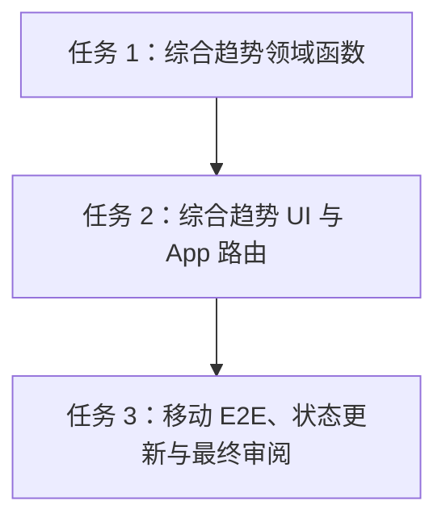

# 架构方案：综合趋势

## 执行元数据

- **Status**：confirmed
- **Workflow Stage**：plan
- **Created**：2026-07-15
- **Updated**：2026-07-15
- **Source Of Truth Until**：主计划任务 8「综合趋势」完成 code、review、提交、推送，并把证据折回 `docs/anvil/plans/2026-07-13-personal-fitness-nutrition-pwa-plan.md`
- **Requirements Source**：`docs/anvil/brainstorms/2026-07-13-personal-fitness-nutrition-pwa.md` 的趋势需求、`docs/anvil/plans/2026-07-13-personal-fitness-nutrition-pwa-plan.md` 任务 8、用户已批准的持续开发目标
- **Compounded Knowledge**：not yet compounded
- **Readiness Path**：`pnpm lint && pnpm typecheck && pnpm test && pnpm build && pnpm test:e2e --project=mobile-chromium --reporter=line`
- **Resume Point**：本计划补齐主计划任务 8 的可执行 DAG。下一步执行 Task 1：综合趋势纯领域函数。Task 8 不新增数据库、RPC、云函数或存储对象；只组合任务 4/5/7 已稳定的用户级仓储端口。

## 模块边界

### 模块：综合趋势领域函数 `src/domain/trends/overviewTrends.ts`

- **职责**：把体重记录和训练记录转换为可展示的移动均线、训练周汇总和整体概览摘要。
- **输入**：`WeightEntry[]`、`WorkoutSession[]`、已由营养趋势领域函数生成的营养点。
- **输出**：`WeightTrendPoint[]`、`WorkoutWeekTrendPoint[]`、空状态/摘要值。
- **依赖**：共享合约类型、既有 `nutritionTrends` 类型；无 React、CloudBase、localStorage、网络或当前时间依赖。
- **不变量**：同一输入得到同一输出；输入不变异；缺数据返回 `null` 或空数组，不伪造趋势；训练容量只使用 `WorkoutSession.volumeKg`。

### 模块：综合趋势页面 `src/features/trends`

- **职责**：移动优先整合营养、体重和训练三个趋势入口，展示可切换的文本摘要、轻量表格和空状态。
- **输入**：`MealsRepository`、`NutritionGoalsRepository`、`WeightRepository`、`WorkoutsRepository`、用户选择结束日期/范围。
- **输出**：`/trends` 鉴权页面，包含“营养 / 体重 / 训练”切换、28 天概览、错误/加载/重试状态。
- **依赖**：平台端口、`src/domain/trends` 纯函数、既有 AuthGate。
- **不变量**：不使用 canvas-only 图表；所有趋势有文本等价；营养和体重建议继续标注为估算，不构成医疗建议；不跨 feature 读取内部 state。

### 模块：App 路由 `src/app`

- **职责**：把 `/trends` 接入鉴权路由和平台依赖。
- **输入**：auth、meals、nutritionGoals、weight、workouts。
- **输出**：受保护综合趋势页，或既有加载/错误/配置缺失 fallback。
- **依赖**：`TrendsPage`、既有平台 loader。
- **不变量**：未登录不能看到用户趋势；CloudBase 配置缺失时失败关闭；test platform 仍只在显式 `?test-platform=1` 下加载。

### 模块：移动 E2E `tests/e2e/trends.spec.ts`

- **职责**：验证真实用户路径可录入目标、餐食、体重、训练，并在 `/trends` 查看三类趋势。
- **输入**：test platform route、移动端 Playwright。
- **输出**：可重复的 mobile-chromium E2E 证据。
- **依赖**：既有 test platform 模式。
- **不变量**：不使用真实 CloudBase、真实邮箱、真实照片或生产密钥；真实 CloudBase smoke 仍作为任务 9/环境 blocker 单独处理。

## 接口定义

```ts
export interface WeightTrendPoint {
  date: string;
  weightKg: number;
  sevenDayAverageKg: number | null;
}

export interface WorkoutWeekTrendPoint {
  weekStartDate: string;
  weekEndDate: string;
  sessionCount: number;
  volumeKg: number;
  topSetWeightKg: number | null;
}

export interface TrendsPageProps {
  meals: MealsRepository;
  nutritionGoals: NutritionGoalsRepository;
  weight: WeightRepository;
  workouts: WorkoutsRepository;
  initialEndDate?: string;
}
```

## 日志规范

前端本切片不新增生产日志。错误仅显示稳定中文文案，不输出用户邮箱、餐食名称、训练备注、体重备注、CloudBase provider detail 或 userId。E2E/评审文档只记录命令结果和阻塞条件。

## RTK 过滤预设

- 领域：`pnpm_config_verify_deps_before_run=warn pnpm vitest run src/domain/trends/overviewTrends.test.ts`
- UI/App：`pnpm_config_verify_deps_before_run=warn pnpm vitest run src/features/trends/TrendsPage.test.tsx src/app/App.test.tsx`
- E2E：`pnpm_config_verify_deps_before_run=warn pnpm test:e2e --project=mobile-chromium --reporter=line tests/e2e/trends.spec.ts`
- 全量：`pnpm_config_verify_deps_before_run=warn pnpm lint && pnpm_config_verify_deps_before_run=warn pnpm typecheck && pnpm_config_verify_deps_before_run=warn pnpm test && pnpm_config_verify_deps_before_run=warn pnpm build && pnpm_config_verify_deps_before_run=warn pnpm test:e2e --project=mobile-chromium --reporter=line`

## 历史经验约束

- `docs/solutions` 当前不存在，未检索到项目级历史知识库。
- 继承任务 7 经验：趋势 UI 首版用表格和轻量 CSS，不引入图表库；缺目标/缺数据不能伪造 0%；真实 CloudBase smoke 缺环境时必须明确 blocker。
- 继承任务 4/5 经验：体重与训练列表按用户会话隔离；页面只能消费平台端口，不读取 feature 内部 state。

## 关键模式检查

- ❌ 综合趋势页自己重算营养目标历史；✅ 复用 `buildDailyNutritionTrend` / `buildWeeklyNutritionTrend`。
- ❌ 直接从浏览器读取 CloudBase 表或传 `userId`；✅ 只消费已有 auth-bound repositories。
- ❌ 图形是唯一信息来源；✅ 表格/文本摘要提供等价信息。
- ❌ 体重不足 7 天时显示误导性均线；✅ `sevenDayAverageKg` 为 `null` 并显示“数据不足”。
- ❌ 训练未完成组参与趋势；✅ 使用已由仓储/领域保存的 `volumeKg`，该值只统计 completed set。
- ❌ `/trends` 成为新写入口；✅ 本页只读，录入仍在 `/today`、`/weight`、`/workouts`。

## 简化审计

- 不新增数据库、RPC、云函数、存储桶或图表依赖。
- 不做任意维度钻取、导出、预测、教练建议或跨用户分享。
- 首版范围固定为结束日前 28 天；营养页已有 7/28 细节，本页只做综合概览。
- 不实现复杂图表库，使用小型文本指标、表格和 CSS 条形。

## 任务 DAG



## 并行执行计划

| Layer | Parallel Group | Tasks | Execution | Reason |
|-------|----------------|-------|-----------|--------|
| 1 | G1 | 任务 1 | serial | 新增共享领域类型和函数，供 UI 消费 |
| 2 | G2 | 任务 2 | serial | 修改 App 路由和组合多个仓储端口 |
| 3 | G3 | 任务 3 | serial | 全量验证、状态回写、最终审阅和提交推送 |

## 任务列表

### 任务 1：综合趋势领域函数

- **Layer**：1
- **Parallel Group**：G1
- **Execution**：serial
- **Parallel Blocker**：共享领域类型
- **Ownership**：`src/domain/trends/overviewTrends.ts`、`src/domain/trends/overviewTrends.test.ts`、`src/domain/trends/index.ts`
- **Read Set**：`src/domain/trends/nutritionTrends.ts`、`packages/contracts/src/weight.ts`、`packages/contracts/src/workouts.ts`
- **Write Set**：同 Ownership
- **描述**：实现体重 7 日移动均线、训练周汇总和综合摘要所需纯函数。
- **成功标准**：体重按日期排序并计算最近 7 条记录均线；不足 7 条为 `null`；训练按连续 7 天窗口汇总 sessionCount、volumeKg、topSetWeightKg；空输入返回空数组；输入数组不被变异。
- **预估 Token**：45k
- **依赖**：任务 4/5/7 已完成
- **涉及文件**：
  - Create `src/domain/trends/overviewTrends.ts`
  - Create `src/domain/trends/overviewTrends.test.ts`
  - Modify `src/domain/trends/index.ts`
- **执行指令**：
  1. 写 RED 测试：体重不足 7 条、刚好 7 条、乱序输入、训练周汇总、空输入和不变异。
  2. 运行 RED：`pnpm_config_verify_deps_before_run=warn pnpm vitest run src/domain/trends/overviewTrends.test.ts`。
  3. 实现最小纯函数；不得读取当前时间或平台端口。
  4. 运行 GREEN、typecheck、lint、diff check。

### 任务 2：综合趋势 UI 与 App 路由

- **Layer**：2
- **Parallel Group**：G2
- **Execution**：serial
- **Parallel Blocker**：App route、平台 shape 和用户数据组合
- **Ownership**：`src/features/trends/**`、`src/app/App.tsx`、`src/app/App.test.tsx`
- **Read Set**：Task 1 输出、`src/features/nutrition-trends/**`、`src/features/weight/**`、`src/features/workouts/**`、`src/features/auth/**`
- **Write Set**：同 Ownership
- **描述**：实现 `/trends` 鉴权页面，固定展示近 28 天营养完成、体重趋势和训练周汇总，并提供三类趋势切换。
- **成功标准**：未登录看到登录页；登录后并行加载 meals、nutrition goals、weight、workouts；营养、体重、训练三段可切换；空状态可理解；错误可重试且不泄露 provider detail；所有数值有文本等价。
- **预估 Token**：95k
- **依赖**：Task 1
- **涉及文件**：
  - Create `src/features/trends/TrendsPage.test.tsx`
  - Create `src/features/trends/TrendsPage.tsx`
  - Create `src/features/trends/trends.css`
  - Create `src/features/trends/index.ts`
  - Modify `src/app/App.tsx`
  - Modify `src/app/App.test.tsx`
- **执行指令**：
  1. 写 RED 组件/App 测试：未登录、登录后加载、三段切换、空状态、营养目标缺失、体重均线不足、训练周汇总。
  2. 运行 RED：`pnpm_config_verify_deps_before_run=warn pnpm vitest run src/features/trends/TrendsPage.test.tsx src/app/App.test.tsx`。
  3. 实现页面：默认结束日今天，范围固定 28 天；用三个按钮“营养 / 体重 / 训练”切换；复用领域函数；文案包含“趋势和建议均为估算，不构成医疗建议。”。
  4. 接入 App：`AppProps` 和 platform state 必须同时要求 `meals`、`nutritionGoals`、`weight`、`workouts`；未登录和配置缺失沿用既有 fallback。
  5. 运行 GREEN、typecheck、lint、diff check。

### 任务 3：移动 E2E、状态更新与最终审阅

- **Layer**：3
- **Parallel Group**：G3
- **Execution**：serial
- **Parallel Blocker**：全量验证和 Anvil 状态更新
- **Ownership**：`tests/e2e/trends.spec.ts`、`docs/anvil/plans/2026-07-13-personal-fitness-nutrition-pwa-plan.md`、本计划文档、`.ai/anvil/reviews/*`
- **Read Set**：Task 1–2 输出、既有 E2E test platform 模式
- **Write Set**：同 Ownership
- **描述**：新增移动端 test-platform E2E，更新主计划证据，完成最终审阅和保护性提交。
- **成功标准**：E2E 覆盖登录、保存目标、录入餐食/体重/训练、进入 `/trends?test-platform=1`、切换并看到营养/体重/训练趋势；全量 lint/typecheck/test/build/E2E 通过；真实 CloudBase smoke blocker 继续明确。
- **预估 Token**：65k
- **依赖**：Task 2
- **涉及文件**：
  - Create `tests/e2e/trends.spec.ts`
  - Modify `docs/anvil/plans/2026-07-13-personal-fitness-nutrition-pwa-plan.md`
  - Modify `docs/anvil/plans/2026-07-15-integrated-trends-plan.md`
  - Add `.ai/anvil/reviews/2026-07-15-integrated-trends-final-review.md`
- **执行指令**：
  1. 写失败 E2E，使用 test platform route 和 SPA 内导航，不依赖真实 CloudBase。
  2. 运行 RED：`pnpm_config_verify_deps_before_run=warn pnpm test:e2e --project=mobile-chromium --reporter=line tests/e2e/trends.spec.ts`。
  3. 补齐实现后运行 focused E2E，再运行全量 readiness path。
  4. 更新主计划 Task 8 `Code Status`、`Verification`、`Evidence` 和 `Resume Point`。
  5. 完成 Anvil review；无 Critical/High 后提交并推送。

## 会话拆分点

- 拆分点 1：Task 1 完成后，综合趋势纯函数可独立验证。
- 拆分点 2：Task 2 完成后，综合趋势页面可在组件测试中闭环。
- 拆分点 3：Task 3 完成后，任务 8 可提交推送并进入任务 9。

## 通过条件

- [x] 模块边界清晰，领域、UI、App 和 E2E 职责不穿透。
- [x] Simplicity First：不引入图表库、不新增 RPC、不做预测/导出/分享。
- [x] 所有趋势数据只通过现有 auth-bound repositories 读取。
- [x] 缺目标、缺体重、缺训练时不伪造趋势。
- [x] 每个任务有明确 Ownership、Read Set、Write Set 和验证命令。
- [x] App route 和全局 E2E 串行执行。
- [x] 真实 CloudBase blocker 有 owner 和 next step，不伪报通过。
- [x] 没有创建 `.ai/anvil/tasks/*`、JSON 状态文件或第二任务状态系统。
