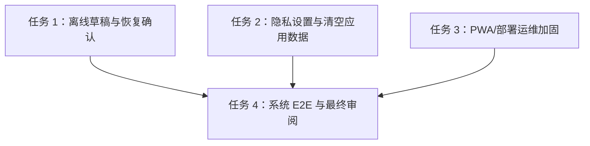

# 架构方案：系统加固、隐私删除与部署验收

## 执行元数据

- **Status**：active
- **Workflow Stage**：plan
- **Created**：2026-07-15
- **Updated**：2026-07-15
- **Source Of Truth Until**：主计划任务 9「离线草稿、隐私删除、系统 E2E 与部署」完成 code、review、提交、推送，并把证据折回 `docs/anvil/plans/2026-07-13-personal-fitness-nutrition-pwa-plan.md`
- **Requirements Source**：`docs/anvil/brainstorms/2026-07-13-personal-fitness-nutrition-pwa.md` 的隐私、离线、PWA、部署与验收需求、主计划任务 9、用户已批准的持续开发目标
- **Compounded Knowledge**：not yet compounded
- **Readiness Path**：`pnpm lint && pnpm typecheck && pnpm test && pnpm build && pnpm test:e2e --project=mobile-chromium --reporter=line`
- **Resume Point**：Task 1「离线草稿与恢复确认」、Task 2「隐私设置与清空应用数据」、Task 3「PWA/部署运维加固」和 Task 4「系统 E2E、状态更新与最终审阅」已完成本地实现、RED/GREEN 验证、全量单测、lint、typecheck、production build、构建产物扫描、全量 mobile E2E 和 diff check；README 交付入口已在 `78c79981 docs: update project handoff readme` 更新并推送。真实 CloudBase、真实视觉模型和大陆网络 smoke 仍需要仓库所有者提供隔离环境后执行；本计划保留 blocker 和可操作 next step，不伪报通过。

## 模块边界

### 模块：离线草稿端口 `src/platform/offline`

- **职责**：提供按用户/页面隔离的表单草稿保存、读取、清除能力。
- **输入**：用户标识 scope、页面 key、版本化草稿 JSON。
- **输出**：已校验草稿或 `null`。
- **依赖**：`safeLocalStorage`、Zod/轻量本地校验；不依赖 React、CloudBase 或网络。
- **不变量**：草稿只保存在本地浏览器；key 必须包含用户 scope；照片二进制、验证码、session、token、签名 URL 和云密钥不得保存。

### 模块：草稿恢复 UI `src/features/*`

- **职责**：在 Today、Weight、Workouts 的未提交表单中保存本地草稿，并在重新进入时让用户确认恢复或丢弃。
- **输入**：当前表单状态、当前用户 scope、草稿端口。
- **输出**：恢复提示、恢复后的表单、清除后的空表单。
- **依赖**：离线草稿端口、既有页面表单状态。
- **不变量**：成功提交后清除草稿；切换用户不会读到其他用户草稿；不自动提交离线草稿。

### 模块：账号数据删除 `src/platform/account` + `cloud/database`

- **职责**：提供“清空我的应用数据”能力，删除当前用户的 profile、nutrition goals、meals、weight、workouts、photo meal analyses 等用户拥有数据。
- **输入**：当前认证会话；用户在设置页输入确认文案。
- **输出**：删除结果摘要和退出/返回引导页的 UI。
- **依赖**：CloudBase auth-bound RPC、test platform 内存清理、设置页。
- **不变量**：客户端不传 `userId`；生产 RPC 只用 `auth.uid()`；删除操作不可由匿名用户执行；不删除 CloudBase 登录身份本身，只删除本应用数据；删除前后跨用户隔离测试必须通过。

### 模块：设置/隐私页面 `src/features/settings`

- **职责**：集中展示隐私说明、清空应用数据、退出登录和运维状态入口。
- **输入**：`AuthPort`、`AccountRepository`。
- **输出**：`/settings` 鉴权页面、确认框、成功/失败状态。
- **依赖**：AuthGate、平台端口。
- **不变量**：危险操作需要明确二次确认；错误文案稳定且不泄露 provider detail。

### 模块：PWA/部署运维文档

- **职责**：明确静态部署、CloudBase 环境变量、缓存边界、大陆网络 smoke、包体/LCP 预算和真实 manual blocker。
- **输入**：现有 `vite.config.ts`、PWA prompt、运维文档、构建产物。
- **输出**：`docs/operations/deployment.md`、更新后的 local/cloudbase 文档、必要的构建扫描测试。
- **依赖**：Vite PWA、Playwright、本地 build。
- **不变量**：Service Worker 不运行时缓存用户 API、验证码、签名 URL 或私有图片；所有服务端密钥只存在服务端/CI secret，不进入浏览器代码或文档示例。

### 模块：系统 E2E `tests/e2e/system.spec.ts`

- **职责**：覆盖首版核心用户路径：设置目标、手动餐食、拍照确认、体重、训练、营养趋势、综合趋势、草稿恢复、隐私删除。
- **输入**：test platform、移动端浏览器。
- **输出**：完整系统验收证据。
- **依赖**：既有 E2E helpers 模式。
- **不变量**：常规自动 E2E 不依赖真实 CloudBase、真实邮箱、真实模型或生产密钥；真实 smoke 保持 manual spec。

## 接口定义

```ts
export interface OfflineDraftRepository<TDraft> {
  load(): Promise<TDraft | null>;
  save(draft: TDraft): Promise<void>;
  clear(): Promise<void>;
}

export interface AccountRepository {
  deleteMyApplicationData(): Promise<{ deleted: true }>;
}
```

## 日志规范

前端不新增生产日志。删除 RPC/云函数如需服务端日志，只允许记录稳定事件名、结果码和不含 userId/email 的 request id；不得记录邮箱、验证码、餐食备注、训练备注、体重备注、照片对象 key、模型响应、session 或 token。测试报告只记录 pass/fail、命令和 blocker。

## RTK 过滤预设

- 离线草稿：`pnpm_config_verify_deps_before_run=warn pnpm vitest run src/platform/offline/BrowserOfflineDraftRepository.test.ts src/features/today/TodayPage.test.tsx src/features/weight/WeightPage.test.tsx src/features/workouts/WorkoutsPage.test.tsx`
- 删除/隐私：`pnpm_config_verify_deps_before_run=warn pnpm vitest run tests/security/accountDeletionIsolation.test.ts tests/security/migrationShape.test.ts src/platform/cloudbase/CloudBaseAccountRepository.test.ts src/platform/testing/createTestPlatform.test.ts src/features/settings/SettingsPage.test.tsx src/app/App.test.tsx`
- PWA/部署：`pnpm_config_verify_deps_before_run=warn pnpm vitest run src/app/PwaUpdatePrompt.test.tsx tests/security/buildArtifactSafety.test.ts`
- E2E：`pnpm_config_verify_deps_before_run=warn pnpm test:e2e --project=mobile-chromium --reporter=line tests/e2e/system.spec.ts`
- 全量：`pnpm_config_verify_deps_before_run=warn pnpm lint && pnpm_config_verify_deps_before_run=warn pnpm typecheck && pnpm_config_verify_deps_before_run=warn pnpm test && pnpm_config_verify_deps_before_run=warn pnpm build && pnpm_config_verify_deps_before_run=warn pnpm test:e2e --project=mobile-chromium --reporter=line`

## 历史经验约束

- `docs/solutions` 当前不存在，未检索到项目级历史知识库。
- 继承既有 CloudBase 安全经验：浏览器端绝不出现服务端密钥；生产数据访问走 fixed search_path 的 auth-bound definer RPC；客户端不传 `userId`。
- 继承 E2E 经验：test platform 数据在单页应用实例内存中，跨页面应使用 SPA 内导航；整页 reload 会重置内存平台，不适合验证同一会话数据流。
- 继承 PWA 经验：更新必须由用户确认，不静默刷新中断表单；SW 不 runtime cache 用户 API 或私有图片。

## 关键模式检查

- ❌ localStorage key 只按页面命名；✅ key 包含用户 scope 和草稿版本。
- ❌ 保存照片、验证码、token 或签名 URL 到草稿；✅ 草稿只保存手动输入的文本/数值字段。
- ❌ 删除接口接受 `userId`；✅ RPC/adapter 只使用当前会话 `auth.uid()`。
- ❌ 删除 CloudBase 登录身份但留下业务数据；✅ 首版明确“清空应用数据”，删除所有用户拥有业务表，登录身份删除若需平台能力则记录为后续/人工步骤。
- ❌ 真实 CloudBase smoke 未执行却写 passed；✅ blocker 写 owner/next step。
- ❌ Service Worker runtime cache 用户接口；✅ 只预缓存静态外壳。

## 简化审计

- 不实现后台同步队列；离线草稿只做本地保存和恢复确认。
- 不删除 CloudBase Auth 身份；只删除本应用业务数据，并在文档中解释边界。
- 不新增后端队列或对象清理定时任务；照片对象清理若当前 CloudBase 存储无法本地验证，记录运维步骤和 blocker。
- 不做真实 LCP 外网测量自动化；本地包体/build 预算自动检查，大陆网络 smoke 作为人工步骤。

## 任务 DAG



## 并行执行计划

| Layer | Parallel Group | Tasks | Execution | Reason |
|-------|----------------|-------|-----------|--------|
| 1 | G1 | 任务 1 | serial | 修改多个表单页面和共享本地草稿端口 |
| 2 | G2 | 任务 2 | serial | 修改生产迁移/RPC、平台 shape 和全局 App route |
| 3 | G3 | 任务 3 | serial | 修改 PWA/部署文档和构建安全检查 |
| 4 | G4 | 任务 4 | serial | 全量系统 E2E、状态回写、最终审阅和提交推送 |

## 任务列表

### 任务 1：离线草稿与恢复确认

- **Layer**：1
- **Parallel Group**：G1
- **Execution**：serial
- **Parallel Blocker**：共享本地草稿端口和多个页面表单
- **Ownership**：`src/platform/offline/**`、`src/features/today/**`、`src/features/weight/**`、`src/features/workouts/**`、`src/app/App.tsx`、`src/app/App.test.tsx`
- **Read Set**：`src/platform/storage/safeLocalStorage.ts`、既有 Today/Weight/Workouts 页面和测试
- **Write Set**：同 Ownership；实际执行中包含 `src/features/today/index.ts`、`src/features/weight/index.ts`、`src/features/workouts/index.ts` 用于向 App 暴露草稿 schema。
- **描述**：实现用户隔离的本地草稿端口，并接入餐食、体重和训练表单的恢复确认。
- **成功标准**：同一用户返回页面可看到“发现未提交草稿”，可恢复或丢弃；成功提交后草稿清除；另一个用户不会读到该草稿；localStorage 不保存照片、验证码、token、session 或签名 URL。
- **预估 Token**：90k
- **依赖**：任务 3/4/5 页面已完成
- **涉及文件**：
  - Create `src/platform/offline/BrowserOfflineDraftRepository.ts`
  - Create `src/platform/offline/BrowserOfflineDraftRepository.test.ts`
  - Create `src/platform/offline/index.ts`
  - Modify `src/features/today/TodayPage.tsx`
  - Modify `src/features/today/TodayPage.test.tsx`
  - Modify `src/features/weight/WeightPage.tsx`
  - Modify `src/features/weight/WeightPage.test.tsx`
  - Modify `src/features/workouts/WorkoutsPage.tsx`
  - Modify `src/features/workouts/WorkoutsPage.test.tsx`
  - Modify `src/app/App.tsx`
  - Modify `src/app/App.test.tsx`
  - Modify `src/features/today/index.ts`
  - Modify `src/features/weight/index.ts`
  - Modify `src/features/workouts/index.ts`
- **执行指令**：
  1. 写 RED：repository key scope、坏 JSON 忽略、清除草稿、Today/Weight/Workouts 恢复/丢弃/提交清除/跨用户隔离。
  2. 运行 RED：RTK 离线草稿命令。
  3. 实现 repository 和页面接入；默认使用 `safeLocalStorage`，storage 不可用时静默降级并保留表单功能。
  4. 运行 GREEN、typecheck、lint、diff check，审阅后提交推送。
- **Code Status**：done
- **Actual Write Set**：
  - `src/platform/offline/BrowserOfflineDraftRepository.ts`
  - `src/platform/offline/BrowserOfflineDraftRepository.test.ts`
  - `src/platform/offline/index.ts`
  - `src/features/today/TodayPage.tsx`
  - `src/features/today/TodayPage.test.tsx`
  - `src/features/today/index.ts`
  - `src/features/weight/WeightPage.tsx`
  - `src/features/weight/WeightPage.test.tsx`
  - `src/features/weight/index.ts`
  - `src/features/workouts/WorkoutsPage.tsx`
  - `src/features/workouts/WorkoutsPage.test.tsx`
  - `src/features/workouts/index.ts`
  - `src/app/App.tsx`
  - `src/app/App.test.tsx`
- **Verification**：
  - RED：`pnpm_config_verify_deps_before_run=warn pnpm vitest run src/platform/offline/BrowserOfflineDraftRepository.test.ts src/features/today/TodayPage.test.tsx src/features/weight/WeightPage.test.tsx src/features/workouts/WorkoutsPage.test.tsx` 失败，缺少 `BrowserOfflineDraftRepository`，三个页面均找不到“发现未提交草稿”。
  - RED：`pnpm_config_verify_deps_before_run=warn pnpm vitest run src/app/App.test.tsx -t "connects the today draft repository"` 失败，`/today` 路由未显示草稿提示。
  - GREEN focused：`pnpm_config_verify_deps_before_run=warn pnpm vitest run src/platform/offline/BrowserOfflineDraftRepository.test.ts src/features/today/TodayPage.test.tsx src/features/weight/WeightPage.test.tsx src/features/workouts/WorkoutsPage.test.tsx src/app/App.test.tsx` 通过，5 files / 44 tests。
  - `pnpm_config_verify_deps_before_run=warn pnpm typecheck` 通过。
  - `pnpm_config_verify_deps_before_run=warn pnpm lint` 通过。
  - `pnpm_config_verify_deps_before_run=warn pnpm test` 通过，44 files / 419 tests。
  - `git diff --check` 通过。
- **Evidence**：本地草稿 key 按 `schemaVersion + userId + pageKey` 隔离；Zod strict schema 拒绝额外字段；Today/Weight/Workouts 均支持“发现未提交草稿”提示、恢复/丢弃、成功提交后清除；App 对认证用户注入 user-scoped 草稿仓库。

### 任务 2：隐私设置与清空应用数据

- **Layer**：2
- **Parallel Group**：G2
- **Execution**：serial
- **Parallel Blocker**：生产删除 RPC、平台 shape、全局 route
- **Ownership**：`cloud/database/migrations/*`、`tests/security/**`、`src/platform/account/**`、`src/platform/cloudbase/**`、`src/platform/testing/createTestPlatform.*`、`src/features/settings/**`、`src/app/App.tsx`、`src/app/App.test.tsx`
- **Read Set**：全部用户拥有表迁移、平台 adapter、AuthGate
- **Write Set**：同 Ownership
- **描述**：新增 auth-bound 删除 RPC、平台端口、test platform 清理和 `/settings` 隐私页面。
- **成功标准**：A 删除后 A 的 profile/goals/meals/weight/workouts/photo analyses 均不可读，B 数据不受影响；生产 RPC 不接受 `userId`；页面需输入确认文案才启用；成功后显示已清空并退出/返回引导页。
- **预估 Token**：130k
- **依赖**：Task 1 可独立，Task 2 可串行执行避免平台 shape 冲突
- **涉及文件**：
  - Create `cloud/database/migrations/0006_account_deletion.sql`
  - Create `tests/security/accountDeletionIsolation.test.ts`
  - Modify `tests/security/migrationShape.test.ts`
  - Create `src/platform/account/AccountRepository.ts`
  - Create `src/platform/account/index.ts`
  - Create `src/platform/cloudbase/CloudBaseAccountRepository.test.ts`
  - Create `src/platform/cloudbase/CloudBaseAccountRepository.ts`
  - Modify `src/platform/cloudbase/createCloudBasePlatform.ts`
  - Modify `src/platform/cloudbase/index.ts`
  - Modify `src/platform/testing/createTestPlatform.ts`
  - Modify `src/platform/testing/createTestPlatform.test.ts`
  - Create `src/features/settings/SettingsPage.test.tsx`
  - Create `src/features/settings/SettingsPage.tsx`
  - Create `src/features/settings/settings.css`
  - Create `src/features/settings/index.ts`
  - Modify `src/app/App.tsx`
  - Modify `src/app/App.test.tsx`
- **执行指令**：
  1. 写 RED：PGlite A/B 删除隔离、migration shape、adapter RPC 参数、test platform 清理、SettingsPage 确认交互和 App route。
  2. 运行 RED：RTK 删除/隐私命令。
  3. 实现 `delete_my_application_data()` fixed search_path definer RPC，只使用 `auth.uid()`，删除所有当前用户业务表；adapter 不传 userId。
  4. 实现 `/settings`；文案明确“清空应用数据，不删除登录身份”。
  5. 运行 GREEN、typecheck、lint、diff check，审阅后提交推送。
- **Code Status**：done
- **Actual Write Set**：
  - `cloud/database/migrations/0006_account_deletion.sql`
  - `tests/security/accountDeletionIsolation.test.ts`
  - `tests/security/migrationShape.test.ts`
  - `tests/security/pgliteAuthHarness.ts`
  - `src/platform/account/AccountRepository.ts`
  - `src/platform/account/index.ts`
  - `src/platform/cloudbase/CloudBaseAccountRepository.ts`
  - `src/platform/cloudbase/CloudBaseAccountRepository.test.ts`
  - `src/platform/cloudbase/createCloudBasePlatform.ts`
  - `src/platform/cloudbase/index.ts`
  - `src/platform/testing/createTestPlatform.ts`
  - `src/platform/testing/createTestPlatform.test.ts`
  - `src/features/settings/SettingsPage.tsx`
  - `src/features/settings/SettingsPage.test.tsx`
  - `src/features/settings/settings.css`
  - `src/features/settings/index.ts`
  - `src/app/App.tsx`
  - `src/app/App.test.tsx`
- **Verification**：
  - RED：`pnpm_config_verify_deps_before_run=warn pnpm vitest run tests/security/accountDeletionIsolation.test.ts tests/security/migrationShape.test.ts src/platform/cloudbase/CloudBaseAccountRepository.test.ts src/platform/testing/createTestPlatform.test.ts src/features/settings/SettingsPage.test.tsx src/app/App.test.tsx` 失败，缺少 `delete_my_application_data()`、`CloudBaseAccountRepository`、`SettingsPage`、`account` platform shape 和 `/settings` route。
  - REVIEW RED：加严 `src/platform/testing/createTestPlatform.test.ts` 后，`pnpm_config_verify_deps_before_run=warn pnpm vitest run src/platform/testing/createTestPlatform.test.ts` 失败，证明测试平台清空当前用户后仍能加载 user-a profile；修复后同一命令通过，1 file / 11 tests。
  - GREEN focused：同一命令通过，6 files / 45 tests。
  - `pnpm_config_verify_deps_before_run=warn pnpm typecheck` 通过。
  - `pnpm_config_verify_deps_before_run=warn pnpm lint` 通过。
  - `pnpm_config_verify_deps_before_run=warn pnpm test` 通过，47 files / 428 tests。
  - `git diff --check` 通过。
- **Evidence**：新增 `delete_my_application_data()` fixed `search_path` definer RPC，不接受 `user_id` 参数，只使用 `auth.uid()` 删除当前用户 profiles/nutrition goals、meals、weight、workouts/children 和 photo meal analyses；CloudBase adapter 调用 RPC 不传身份；test platform 只清当前登录用户内存数据，并通过 `delete-application-data` 测试操作同步清当前用户 profile，不影响另一个用户；`/settings` 鉴权页面要求输入“清空我的数据”才允许危险操作，并明确“清空应用数据，不删除登录身份”。

### 任务 3：PWA/部署运维加固

- **Layer**：3
- **Parallel Group**：G3
- **Execution**：serial
- **Parallel Blocker**：构建产物安全和运维文档
- **Ownership**：`vite.config.ts`、`src/app/PwaUpdatePrompt.*`、`src/app/App.tsx`（因 RED 证明生产包泄漏 test-platform chunk，需剥离测试平台动态导入）、`tests/security/buildArtifactSafety.test.ts`、`docs/operations/**`, `.env.example`
- **Read Set**：现有 PWA 配置、运维文档、构建产物
- **Write Set**：同 Ownership
- **描述**：补齐部署文档、环境变量样例、构建产物安全检查和 PWA 缓存边界验收。
- **成功标准**：构建产物扫描确认无服务端密钥标识、固定测试 OTP、test-platform endpoint、测试邮箱；文档明确 CloudBase 静态托管/自托管部署步骤、大陆网络 smoke 步骤、LCP/包体预算和真实 blocker；PWA 更新/离线提示测试仍通过。
- **预估 Token**：75k
- **依赖**：Task 1–2 可并行概念上独立，但为避免全局文档冲突串行执行
- **涉及文件**：
  - Create `tests/security/buildArtifactSafety.test.ts`
  - Modify `src/app/PwaUpdatePrompt.test.tsx`
  - Modify `src/app/PwaUpdatePrompt.tsx`（仅在需要改善文案/可访问性时）
  - Modify `vite.config.ts`（仅在需要显式 runtime cache 禁用/manifest 补齐时）
  - Create `.env.example`
  - Create `docs/operations/deployment.md`
  - Modify `docs/operations/local-development.md`
  - Modify `docs/operations/cloudbase-test-environment.md`
- **执行指令**：
  1. 写 RED：构建产物安全扫描测试和文档链接检查。
  2. 运行 RED：RTK PWA/部署命令。
  3. 补文档和必要小改动；不得把真实密钥写入样例。
  4. 运行 GREEN、build、typecheck、lint、diff check，审阅后提交推送。
- **Code Status**：done
- **Actual Write Set**：
  - `.env.example`
  - `vite.config.ts`
  - `src/app/App.tsx`
  - `src/app/PwaUpdatePrompt.tsx`
  - `src/app/PwaUpdatePrompt.test.tsx`
  - `tests/security/buildArtifactSafety.test.ts`
  - `docs/operations/deployment.md`
  - `docs/operations/local-development.md`
  - `docs/operations/cloudbase-test-environment.md`
- **Verification**：
  - RED：`pnpm_config_verify_deps_before_run=warn pnpm vitest run tests/security/buildArtifactSafety.test.ts src/app/PwaUpdatePrompt.test.tsx` 失败，暴露缺少 `docs/operations/deployment.md`、`.env.example` 无公开变量安全说明、`vite.config.ts` 无 API/test endpoint navigation denylist、PWA 离线提示未说明缓存边界，且现有 `dist` 含 `createTestPlatform` chunk、`__daily-record-test-platform` 与 `test-platform-client`。
  - GREEN focused：`pnpm_config_verify_deps_before_run=warn pnpm vitest run tests/security/buildArtifactSafety.test.ts src/app/PwaUpdatePrompt.test.tsx src/app/App.test.tsx` 通过，3 files / 30 tests。
  - `pnpm_config_verify_deps_before_run=warn pnpm typecheck` 通过。
  - `pnpm_config_verify_deps_before_run=warn pnpm lint` 通过。
  - `pnpm_config_verify_deps_before_run=warn pnpm test` 通过，48 files / 432 tests。
  - FINAL VALIDATION RED：全量 `pnpm_config_verify_deps_before_run=warn pnpm test` 在执行过 `vite build --mode test` 的 E2E 后失败，原因是 `dist` 被 test-mode 构建覆盖，安全扫描误扫到 `createTestPlatform-*.js`。修复为构建时写入 `dist/.build-mode`，只有 marker 为 `production` 才扫描 dist；同一全量测试随后通过，48 files / 431 passed / 1 skipped。
  - `pnpm_config_verify_deps_before_run=warn pnpm build` 通过；生产构建不再生成 `createTestPlatform` chunk，初始 `index` gzip 112.79 KB，CloudBase 动态 chunk gzip 181.15 KB；Vite >500 KB chunk warning 记录为后续优化，不阻断本任务预算。
  - `pnpm_config_verify_deps_before_run=warn pnpm vitest run tests/security/buildArtifactSafety.test.ts` 通过，1 file / 4 tests，扫描 `dist/` 未发现服务端密钥标识、固定测试 OTP、test-platform endpoint、test-platform client 或测试邮箱。
  - `git diff --check` 通过。
- **Evidence**：新增生产构建产物安全扫描测试，要求部署文档、大陆网络 smoke、LCP/包体预算、真实 blocker、env 样例和 Workbox 边界可自动验证；生产构建通过 `strip-test-platform-from-production` Vite pre-transform 剥离 test platform loader，`vite build` 后 dist 不含测试端点/固定验证码/测试邮箱/服务端 secret marker；PWA 离线提示明确只缓存静态应用外壳，不缓存餐食照片或账号接口；运维文档补齐 CloudBase 静态托管、自托管、中国大陆网络 smoke 和 blocker owner/next step。

### 任务 4：系统 E2E、状态更新与最终审阅

- **Layer**：4
- **Parallel Group**：G4
- **Execution**：serial
- **Parallel Blocker**：最终验收、全量验证和 Anvil 状态更新
- **Ownership**：`tests/e2e/system.spec.ts`、`docs/anvil/plans/2026-07-13-personal-fitness-nutrition-pwa-plan.md`、本计划文档、`.ai/anvil/reviews/*`
- **Read Set**：Task 1–3 输出和全部既有 E2E
- **Write Set**：同 Ownership
- **描述**：新增完整移动端系统 E2E，更新主计划证据，完成最终审阅和保护性提交。
- **成功标准**：系统 E2E 覆盖核心闭环、草稿恢复、清空应用数据后不可读；全量 lint/typecheck/test/build/E2E 通过；真实 CloudBase/模型/大陆网络 smoke blocker 保持明确 owner/next step。
- **预估 Token**：90k
- **依赖**：Task 1–3
- **涉及文件**：
  - Create `tests/e2e/system.spec.ts`
  - Modify `docs/anvil/plans/2026-07-13-personal-fitness-nutrition-pwa-plan.md`
  - Modify `docs/anvil/plans/2026-07-15-system-hardening-deployment-plan.md`
  - Add `.ai/anvil/reviews/2026-07-15-system-hardening-final-review.md`
- **执行指令**：
  1. 写 RED 系统 E2E，使用 test platform route 和 SPA 内导航。
  2. 运行 RED：`pnpm_config_verify_deps_before_run=warn pnpm test:e2e --project=mobile-chromium --reporter=line tests/e2e/system.spec.ts`。
  3. 补齐实现后运行 focused E2E，再运行全量 readiness path。
  4. 更新主计划 Task 9 `Code Status`、`Verification`、`Evidence` 和 `Resume Point`。
  5. 完成最终 Anvil review；无 Critical/High 后提交并推送。
- **Code Status**：done
- **Actual Write Set**：
  - `tests/e2e/system.spec.ts`
  - `docs/anvil/plans/2026-07-13-personal-fitness-nutrition-pwa-plan.md`
  - `docs/anvil/plans/2026-07-15-system-hardening-deployment-plan.md`
  - `.ai/anvil/reviews/2026-07-15-system-hardening-final-review.md`
  - Corrective validation fix：`vite.config.ts`、`tests/security/buildArtifactSafety.test.ts`
- **Verification**：
  - Focused E2E sandbox RED：`pnpm_config_verify_deps_before_run=warn pnpm test:e2e --project=mobile-chromium --reporter=line tests/e2e/system.spec.ts` 在沙箱内失败，原因是 preview server 监听 `127.0.0.1:4173` 被 EPERM 拦截。
  - Focused E2E GREEN：同一命令经批准外部执行通过，1 passed，覆盖登录设目标、今日页草稿恢复、餐食/体重/训练保存、综合趋势、设置页清空、清空后餐食/体重/训练不可读。
  - `pnpm_config_verify_deps_before_run=warn pnpm lint` 通过。
  - `pnpm_config_verify_deps_before_run=warn pnpm typecheck` 通过。
  - `pnpm_config_verify_deps_before_run=warn pnpm test` 通过，48 files / 431 passed / 1 skipped；skip 为非 production build marker 下的 dist 扫描，发布门禁通过下条 production scan 覆盖。
  - `pnpm_config_verify_deps_before_run=warn pnpm build` 通过；production build 不含 test-platform chunk，`index` gzip 112.79 KB，CloudBase 动态 chunk gzip 181.15 KB。
  - `pnpm_config_verify_deps_before_run=warn pnpm vitest run tests/security/buildArtifactSafety.test.ts` 通过，1 file / 4 tests。
  - `pnpm_config_verify_deps_before_run=warn pnpm test:e2e --project=mobile-chromium --reporter=line` 经批准外部执行通过，8 passed / 1 real CloudBase manual skipped。
- **Evidence**：新增 `tests/e2e/system.spec.ts` 完整移动端系统流；最终 readiness path 覆盖 lint、typecheck、unit、production build、构建产物安全扫描和全量 mobile E2E。真实 CloudBase OTP/CAPTCHA/双 session、真实视觉模型和中国大陆网络 smoke 仍 blocked，owner=仓库所有者，next=按 `docs/operations/cloudbase-test-environment.md` 与 `docs/operations/deployment.md` 配置隔离环境、模型变量、测试邮箱和大陆网络设备后执行并记录脱敏摘要。

## 会话拆分点

- 拆分点 1：Task 1 完成后，离线草稿可独立验证。
- 拆分点 2：Task 2 完成后，隐私删除闭环可独立验证。
- 拆分点 3：Task 3 完成后，PWA/部署运维证据齐备。
- 拆分点 4：Task 4 完成后，首版实现进入最终完成审计。

## 通过条件

- [x] 模块边界清晰，离线、隐私删除、PWA/部署和 E2E 职责不穿透。
- [x] Simplicity First：不做后台同步队列、不新增真实账号删除、不做自动外网 LCP。
- [x] 用户草稿按用户 scope 隔离，不保存敏感凭据/照片。
- [x] 删除操作只使用当前认证会话，不传 `userId`。
- [x] 每个任务有明确 Ownership、Read Set、Write Set 和验证命令。
- [x] 生产迁移、平台 shape、App route 和全局 E2E 串行执行。
- [x] 真实 CloudBase/模型/大陆网络 smoke blocker 有 owner 和 next step，不伪报通过。
- [x] 没有创建 `.ai/anvil/tasks/*`、JSON 状态文件或第二任务状态系统。
